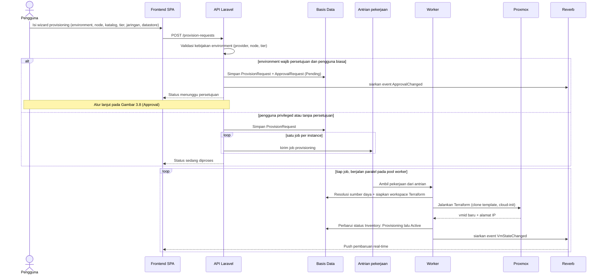

# Gambar 3.7 — Sequence Diagram: Provisioning Mesin Virtual (versi high-level)

Urutan interaksi rancangan dari submit permintaan hingga mesin virtual siap.
Setiap permintaan dipecah menjadi satu pekerjaan per instance yang dirancang
berjalan paralel pada pool worker.

