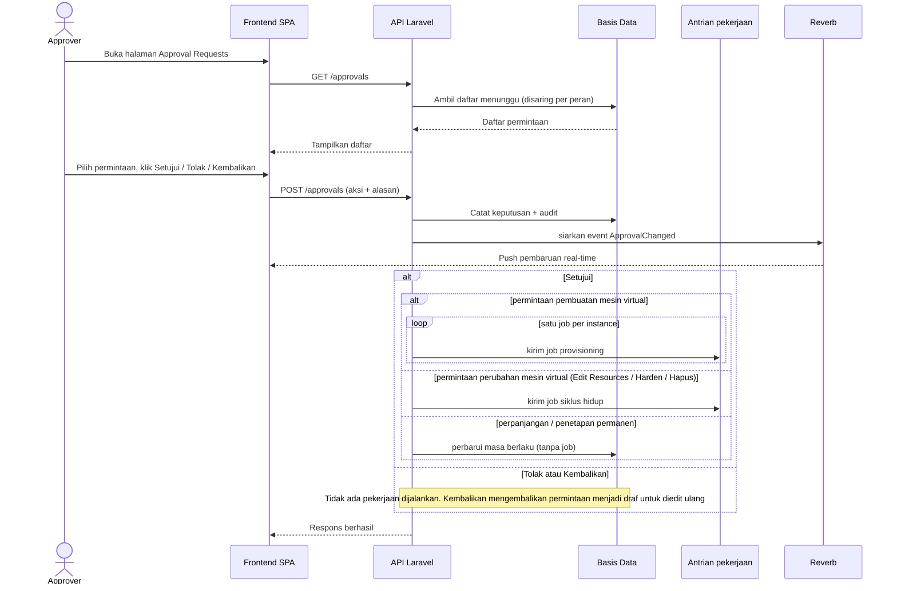

# Gambar 3.8 — Sequence Diagram: Approval Request (versi high-level)

Urutan keputusan persetujuan oleh Approver (Manajer atau Administrator). Aksi
Kembalikan dibatasi pada permintaan pembuatan mesin virtual baru, sedangkan
permintaan terhadap mesin virtual aktif hanya menerima Setujui atau Tolak. Pada
persetujuan, sistem menjalankan permintaan: pembuatan dan perubahan mesin virtual
dijalankan sebagai pekerjaan asinkron, sedangkan perpanjangan dan penetapan permanen
diterapkan sebagai pembaruan data tanpa pekerjaan.

