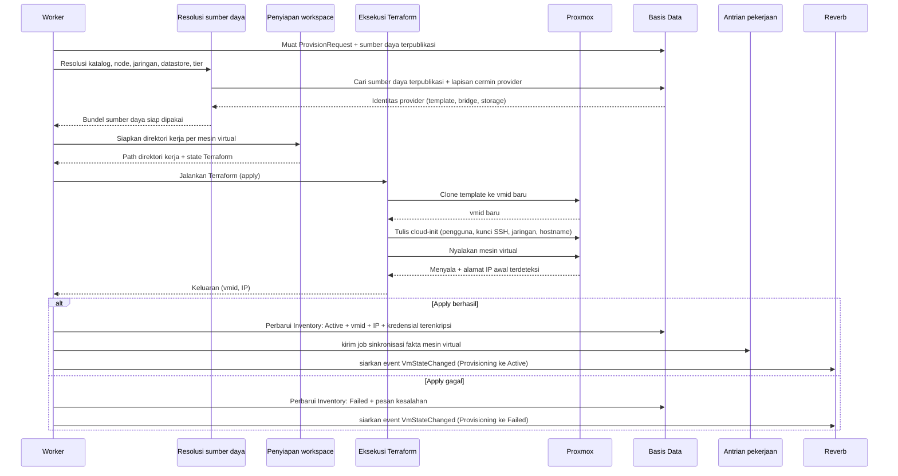

# Gambar 3.9 — Sequence Diagram: Eksekusi Terraform ke Proxmox VE (versi high-level)

Rincian rancangan satu proses provisioning, dari resolusi sumber daya hingga
eksekusi Terraform terhadap Proxmox dan sinkronisasi fakta mesin virtual. Diagram
ini melengkapi Gambar 3.7 dengan menampilkan lapisan layanan internal.

