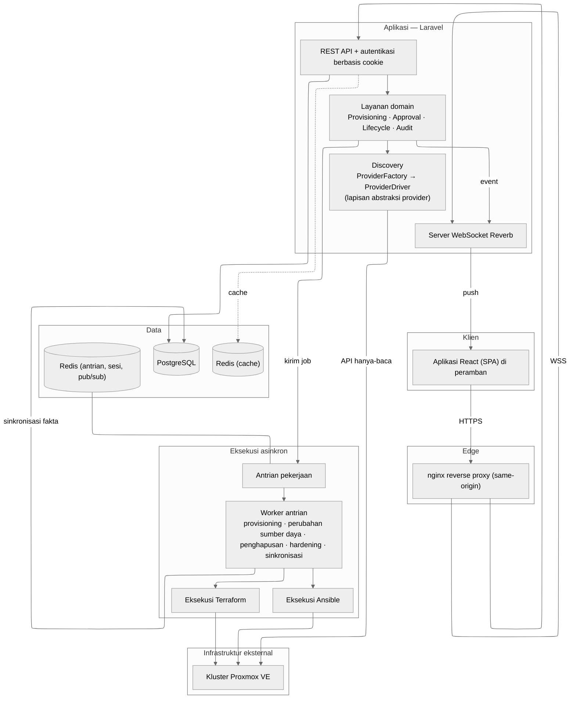

# Gambar 3.2 — Arsitektur Sistem (versi high-level)

Pandangan rancangan arsitektur berlapis. Versi ini menyembunyikan detail
operasional (port, jumlah worker, nama kelas teknis) yang ditegaskan pada Bab 4.

