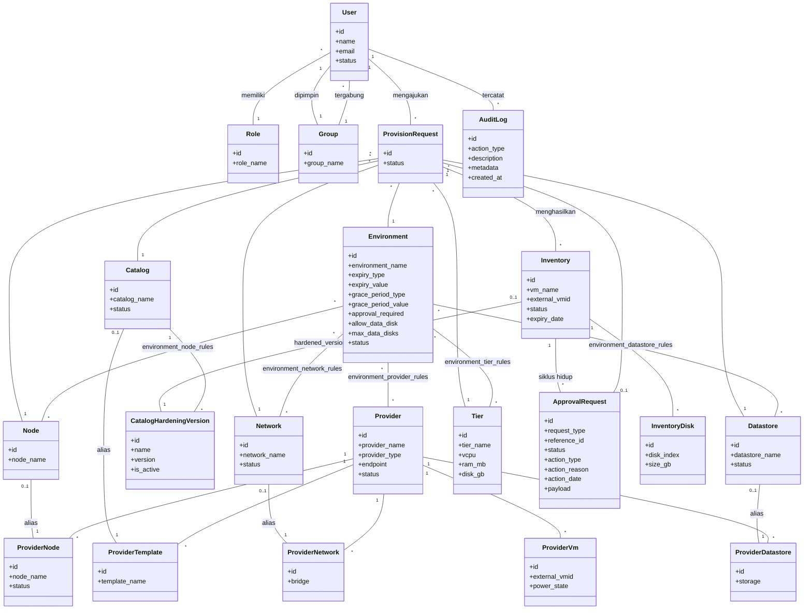

# Gambar 3.10 — Class Diagram

Lingkup entitas domain (Eloquent models di `backend/app/Models/`). Nama atribut
selaras dengan kolom kunci pada ERD Gambar 3.11; kolom foreign key tidak
ditampilkan secara eksplisit karena diwakili oleh relasi antar kelas. Detail
penuh tetap pada ERD. Kelas layanan (`ProvisionRequestService`,
`LifecycleService`, dll.) tidak ditampilkan demi menjaga pemisahan tanggung
jawab dengan diagram arsitektur.

