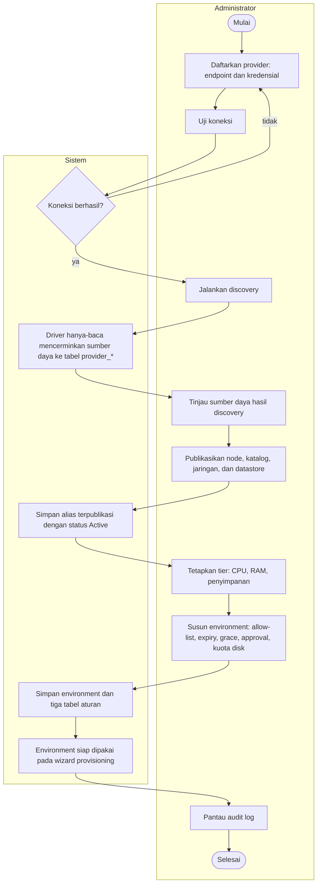

# Gambar 3.13 — Activity Diagram: Penyiapan dan Tata Kelola oleh Administrator

Dua swimlane: Administrator dan Sistem. Diagram menggambarkan urutan penyiapan
platform oleh administrator, dari pendaftaran provider, discovery, publikasi
sumber daya, penetapan tier, hingga penyusunan kebijakan environment, serta
pemantauan audit log. Aktivitas ini melengkapi Gambar 3.12 dengan menampilkan
sisi prosedural pembentukan lapisan abstraksi dan kebijakan.

