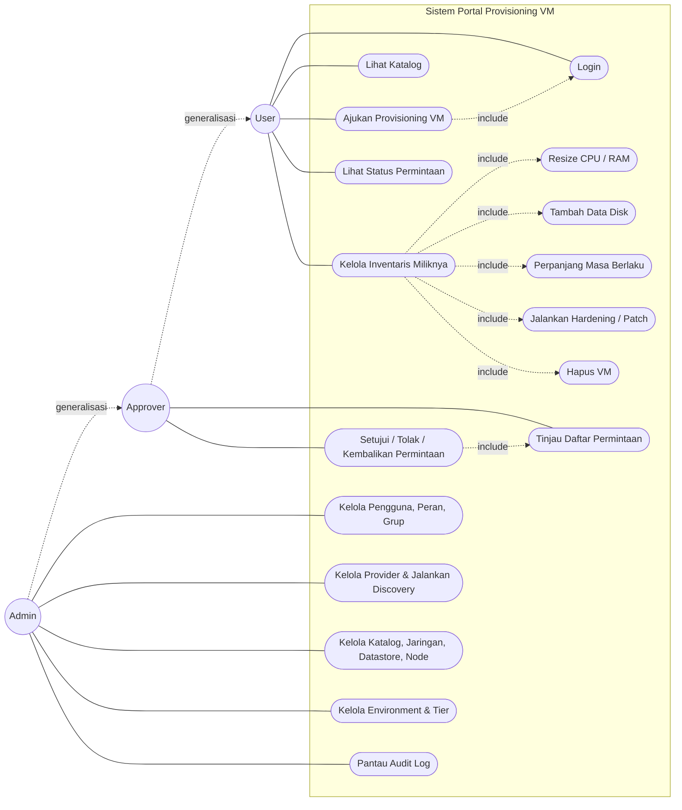

# Gambar 3.3 — Use Case Diagram

Interaksi tiga aktor terhadap sistem portal provisioning VM. Generalisasi
aktor: Admin mewarisi Approver, Approver mewarisi User. Pada implementasi,
aktor User memetakan peran User, Approver memetakan peran Manager (peran yang
berwenang menyetujui), dan Admin memetakan peran Administrator.

