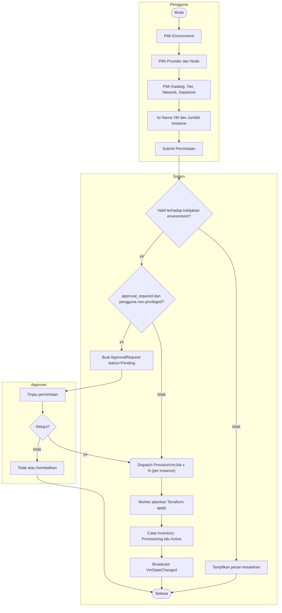

# Gambar 3.4 — Activity Diagram: Provisioning Mesin Virtual

Tiga swimlane: Pengguna, Sistem, Approver. Gerbang persetujuan aktif jika
environment menetapkan `approval_required` dan pengguna bukan privileged
(Manager/Admin).

