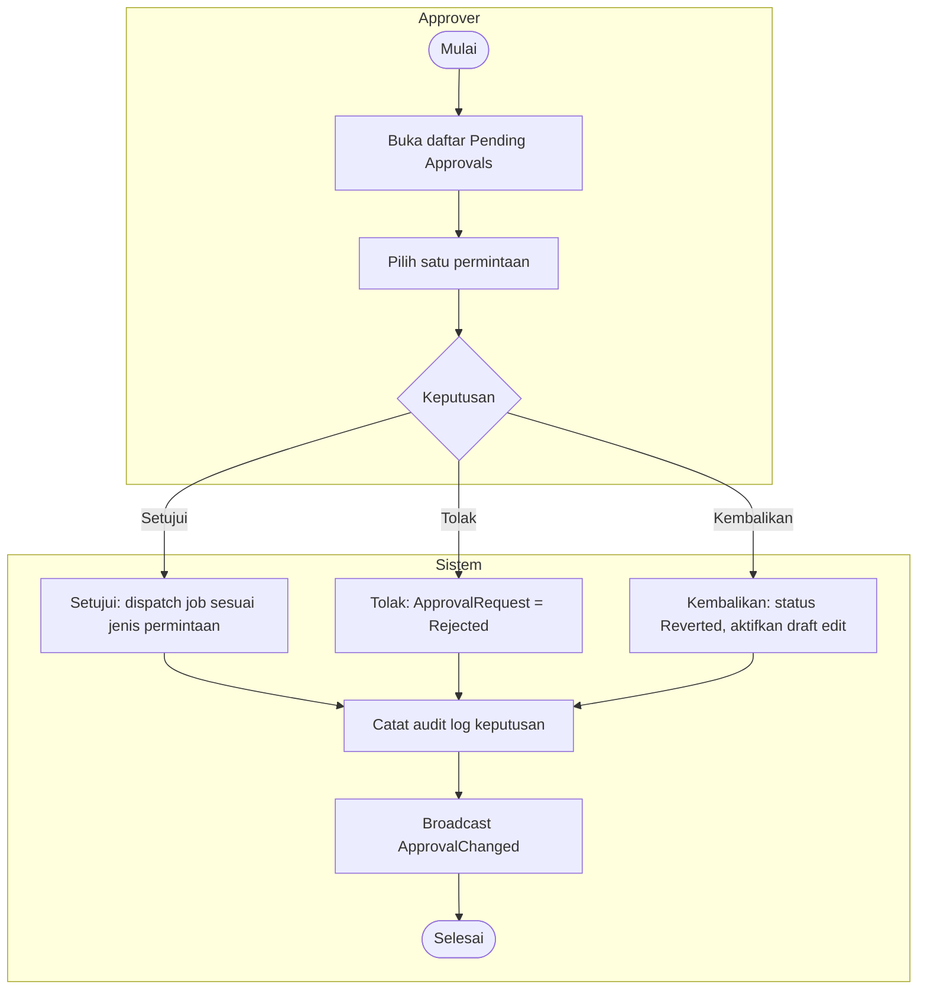

# Gambar 3.5 — Activity Diagram: Approval Request

Dua swimlane: Approver dan Sistem. Aksi Kembalikan hanya berlaku untuk
permintaan jenis PROVISION (mengembalikan ke draft untuk diedit ulang).

```mermaid
flowchart TB
    subgraph AP [Approver]
        S1([Mulai])
        A1[Buka daftar Pending Approvals]
        A2[Pilih satu permintaan]
        A3{Keputusan}
    end

    subgraph SY [Sistem]
        T1[Setujui: dispatch job sesuai jenis permintaan]
        T2[Tolak: ApprovalRequest = Rejected]
        T3[Kembalikan: status Reverted, aktifkan draft edit]
        LOG[Catat audit log keputusan]
        BR[Broadcast ApprovalChanged]
        E1([Selesai])
    end

    S1 --> A1 --> A2 --> A3
    A3 -- Setujui --> T1 --> LOG
    A3 -- Tolak --> T2 --> LOG
    A3 -- Kembalikan --> T3 --> LOG
    LOG --> BR --> E1
```
