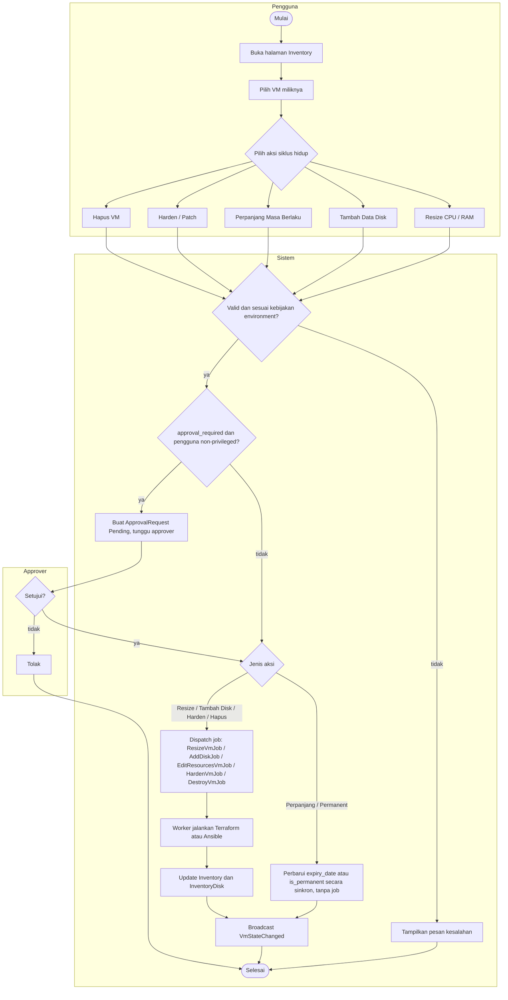

# Gambar 3.6 — Activity Diagram: Inventory Mesin Virtual

Tiga swimlane: Pengguna, Sistem, Approver. Lima aksi siklus hidup (Resize,
Tambah Disk, Perpanjang, Hardening, Hapus) memakai gerbang persetujuan yang
sama seperti provisioning awal. Setelah lolos gerbang, Perpanjang dan Permanent
diterapkan sinkron sebagai pembaruan masa berlaku tanpa job; Resize, Tambah Disk,
dan Hapus menjalankan Terraform, sedangkan Hardening menjalankan Ansible.

