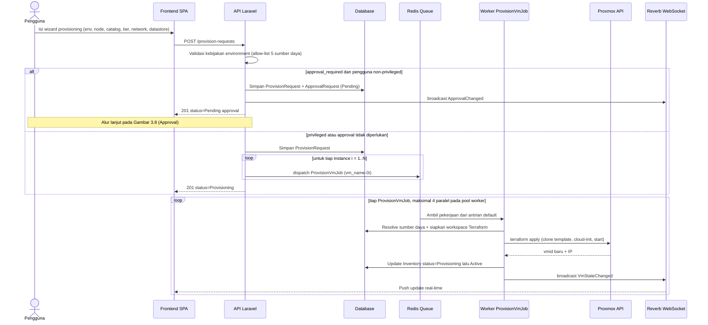

# Gambar 3.7 — Sequence Diagram: Provisioning Mesin Virtual

Urutan interaksi end-to-end mulai dari submit permintaan hingga VM siap.
Pengiriman pekerjaan ke queue dilakukan per instance; pool worker menjalankan
maksimal 4 pekerjaan secara paralel (lihat §3.7 hasil benchmark backend).

