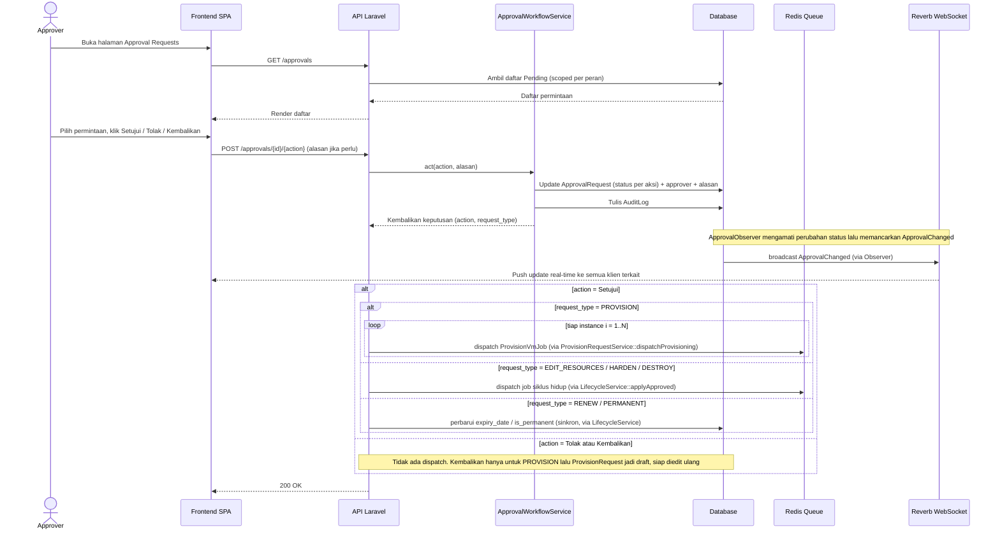

# Gambar 3.8 — Sequence Diagram: Approval Request

Urutan keputusan persetujuan oleh Approver (Manager/Admin). Aksi Kembalikan
(Revert) dibatasi pada permintaan jenis PROVISION; permintaan siklus hidup
(Edit Resources/Renew/Harden/Destroy) hanya menerima Setujui atau Tolak. Pada
persetujuan, Edit Resources, Harden, dan Destroy mengirim job, sedangkan Renew
dan Permanent diterapkan sinkron tanpa job. Layanan *ApprovalWorkflowService*
hanya mencatat keputusan dan menulis audit; pengiriman job dilakukan oleh
controller setelah keputusan tercatat, dan notifikasi *ApprovalChanged*
dipancarkan oleh observer saat status berubah.

