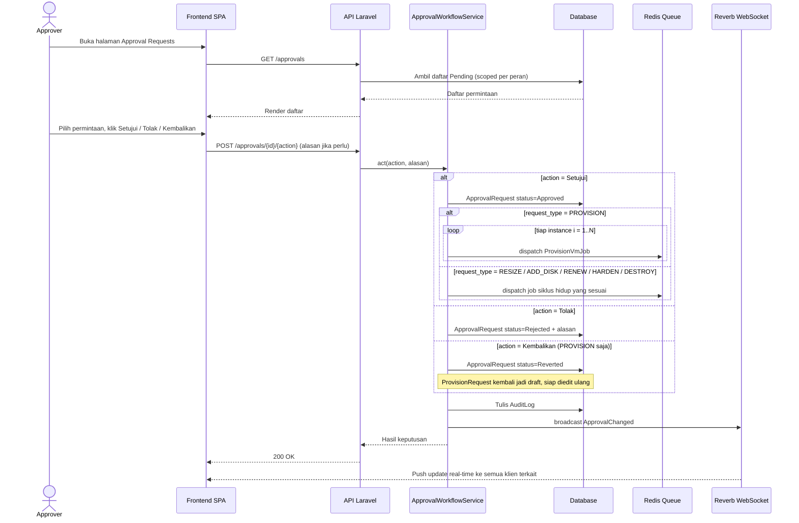

# Gambar 3.8 — Sequence Diagram: Approval Request

Urutan keputusan persetujuan oleh Approver (Manager/Admin). Aksi Kembalikan
(Revert) dibatasi pada permintaan jenis PROVISION; permintaan siklus hidup
(Resize/AddDisk/Renew/Harden/Destroy) hanya menerima Setujui atau Tolak.

