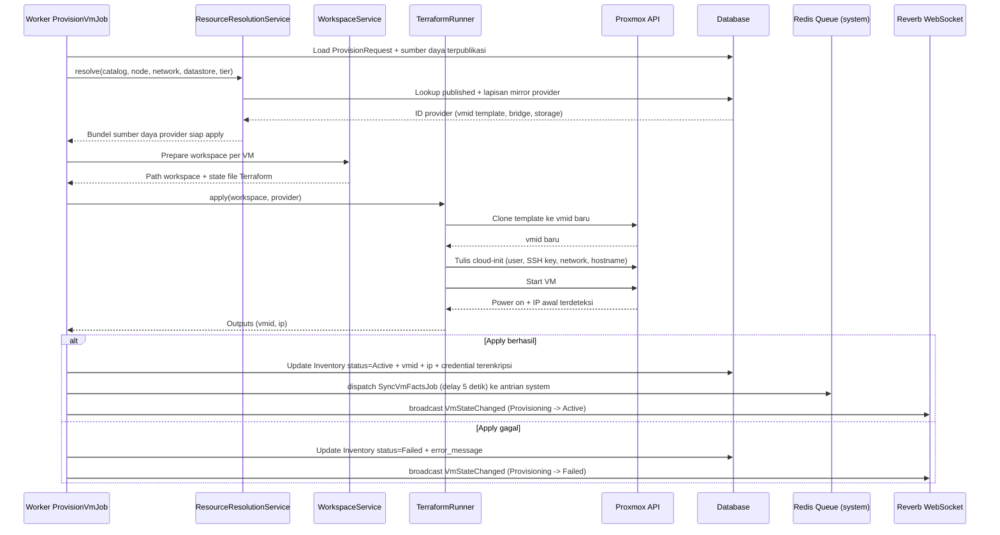

# Gambar 3.9 — Sequence Diagram: Eksekusi Terraform ke Proxmox VE

Detail internal satu ProvisionVmJob: dari resolusi sumber daya hingga apply
Terraform terhadap Proxmox API dan sinkronisasi fakta VM. Diagram ini
melengkapi Gambar 3.7 dengan menampilkan lapisan layanan internal.

