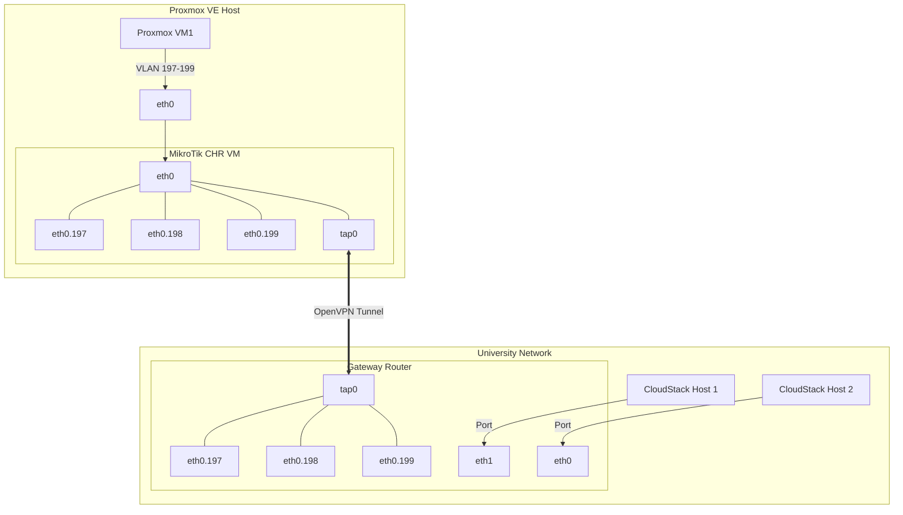

# The practice of developing the academic cloud using the Proxmox VE platform

## Abstract
Cloud technologies provide users with efficient and secure tools for data management, computing, storage and other services. The article analyzes the projects for the introduction of cloud technologies in education and identifies the main advantages and risks in creating a cloud infrastructure for the university. Such startups contribute to the formation of a new paradigm of education. It involves the virtualization of education, the introduction of mobile and blended learning, ie the combination of cloud computing with modern learning concepts. In this paper, we highlight our experience in improving the academic cloud for the training of a bachelor’s degree in computer science. This is through the integration of the Proxmox VE platform into existing computing power by deploying the Proxmox VE system. In the study, we reveal some technical and methodological aspects of the organization of the educational process using this corporate cloud platform. The scheme of the organization of physical components of cloud infrastructure (nodes, virtual networks, routers, domain controller, VPN server, backup system of students’ virtual machines) is given. All characteristics of this environment and possibilities of their application are studied.

**Keywords:** cloud computing, cloud infrastructure, academic cloud, computer networks, Apache Cloudstack, Proxmox VE

---

## 1. Introduction
* **Context:** Cloud computing and open-access systems in education are cost-effective, reducing the need for large IT infrastructure budgets. Over the last decade, it has become a popular paradigm.
* **Problem:** Ukrainian educational institutions face limited technical and material resources, lack of IT personnel, and limited teaching staff.
* **Objective:** To describe the model of the academic cloud for training computer science teachers and systematize deployment experiences using Proxmox VE.
* **Benefits:** Cloud platforms virtualize computing resources (servers, OS, storage, networks) to improve the digital learning environment, offering flexibility, disaster recovery, redundancy, and performance.
* **Shortcomings:** Missing specialized services, service level agreement constraints, and security issues.

---

## 2. Related Work
* **Academic Cloud Concept:** Interpretations emphasize an electronic learning environment where computational and procedural functions are virtualized.
* **Key Characteristics:** Self-service, broad network access, resource pooling, rapid elasticity, measured service, flexibility, interactivity, and personalization.
* **Existing Implementations:**
  * US universities: Students experiment with large-scale distributed computing by leasing infrastructure.
  * *Selviandro et al. (2014):* Studied performance indicators and resource scalability.
  * *Baharuddin et al. (2021):* Explored cloud computing abstraction (processors, storage, software) in electrical engineering curricula.

---

## 3. Results

### 3.1. Descriptive Model of the Academic Cloud
The model comprises three key components:
1. **Content Component:**
   * Virtual computers and networks for learning.
   * Real-world simulation of information systems.
   * Flexibly customizable objects of study for teachers/students.
   * Ubiquitous local/internet access.
   * Single sign-on authentication.
2. **Technical and Organizational Component:**
   * Deployment of numerous VMs and standard protocol access (IaaS).
   * Virtual network routing between physical and virtual layers.
   * User authentication using standard databases.
   * Resource redistribution.

#### Transition from Apache CloudStack to Proxmox VE
The university had years of experience with Apache CloudStack. While useful (domain categorization, external DB authentication, VM sharing), it had severe technical challenges:
* Poor resource allocation.
* Manual user account addition.
* Difficult VM lifecycle management (deletion, transfer, locking).
* Lack of simple backup solutions and a free mobile version.

#### Proxmox VE Selection Criteria
* Free and open-source.
* Native support for IaaS.
* Simple deployment/maintenance.
* LDAP/external DB authentication.
* Template creation and disk backup functionality.
* Horizontal scalability (adding nodes/storage).

---

### 3.2. Students' Access Rights to VM in the Cloud
* **Hardware:** 1 refurbished physical server (Intel Xeon, 32 GB RAM) rented due to war-related access issues to university buildings.
* **Access Control:** Implemented via user groups.
* **VM Provisioning Approaches:**
  1. *Admin-driven:* Administrator creates VMs and delegates specific permissions (e.g., administrative access).
  2. *Student-driven:* Students clone VMs from templates according to pre-allocated permissions.

#### Table 1: Proxmox VE Permissions for Template Cloning
| Permission / Role | Account Type | Path | Propagate | Description |
| :--- | :--- | :--- | :---: | :--- |
| `PVEAuditor` | Group | `/` | `+` | Read-only access |
| `PVEDatastoreUser` | Group | `/storage` | `+` | Allocate backup space and view storage |
| `PVETemplateUser` | Group | `/pool` | `+` | View and clone templates |
| `PVEVMUser` | Group | `/nodes` | `+` | View, backup, and VM power management |
| `Administrator` | User | `/vms/VM_ID` | `-` | Full privileges to manage operation |

* **ACL Command Example:**
  ```bash
  pveum acl modify /vms/<VM_ID> -user <username>@pam -role Administrator
  ```
* **User Management:** Scripts retrieve user lists from LDAP and assign corresponding IDs. During cloning, students must specify the designated VM ID provided by the instructor (Figure 1).

---

### 3.3. Unified Access of Student to Academic Cloud
Authentication is integrated with the university's LDAP (Active Directory):
* Domain controller IP/port, bind user credentials, and user group attributes are configured.
* Directory synchronization is automated via:
  ```bash
  pveum realm sync <realm>
  ```

---

### 3.4. Allocation of Computing Resources of the Academic Cloud
* **Apache CloudStack Issue:** Reserved CPU and RAM configurations led to resource waste. Overcommit settings caused instability and denial of service.
* **Proxmox VE Solution:** Use of Linux Containers (LXC). LXC shares the host kernel, significantly reducing virtualization overhead and security isolation.
* **Experiment:** A server running **120 containers** (1 core, 768 MB RAM each) generated ~40 Mbps network traffic under stable loads. Proxmox VE can run at least **5 times more containers** than VMs on the same hardware.

#### Table 2: VM Capacity Comparison (CloudStack vs. Proxmox VE at 90% CPU Load)
| OS Type | Apache CloudStack (VMs) | Proxmox VE (VMs/LXC) | Note |
| :--- | :---: | :---: | :--- |
| Linux CLI | 50 | 120 | Proxmox uses LXC containers for CLI |
| Linux GUI | 18 | 19 | Similar performance |
| Windows Workstation | 20 | 22 | Similar performance |
| Windows Server | 16 | 16 | Identical performance |
| Advanced Linux | 12 | 8 | Nested virtualization (e.g., EVE-NG) performs worse in Proxmox |

---

### 3.5. Connection of Networks between Clouds
* **Goal:** Assign a separate VLAN for each student/academic group and integrate with the university network.
* **Challenge:** Proxmox VE does not natively support OpenVPN tap/tun tunnel interfaces.
* **Solution:** Deploy a separate VM running **MikroTik Cloud Hosted Router (CHR)** configured as an OpenVPN server.



---

### 3.6. Ubiquitous Access via Mobile Devices
* Proxmox VE provides a mobile-responsive web interface supporting basic operations: start, stop, pause, migration, task monitoring, and VNC console access.
* Although Windows VM consoles are less convenient on mobile screens, the feature is highly useful for distance learning and emergency management.

---

### 3.7. Backup of the Academic Cloud
* Automatic backups are scheduled to a remote NFS share connected via OpenVPN.
* Virtual machines are backed up "on the fly".
* To allow students to perform manual backups, the administrator must assign the `Datastore.AllocateSpace` permission.
* Large-scale deployments require a dedicated Proxmox Backup Server.

---

## 4. Conclusions
1. The academic cloud is a key element of the digital educational environment for training IT specialists, allowing students to safely model and study network and system administration.
2. Proxmox VE is a modern, open, and technically simple platform for academic clouds.
3. Performance testing indicates Proxmox VE matches Apache CloudStack capacity when running VMs and significantly exceeds it (5x efficiency gain) when utilizing LXC containers for CLI environments, though nested virtualization performance (EVE-NG) is slightly lower.
4. OpenVPN integration via MikroTik CHR bridges network segregation (VLANs) across separate cloud infrastructures.

---

## References
1. Ali, E., Susandri and Rahmaddeni, 2015. Optimizing server resource by using virtualization technology. *Procedia Computer Science*, 59, pp.320–325.
2. Baharuddin, Ampera, D., Febriasari, H., Sembiring, M.A.R. and Hamid, A., 2021. Implementation of cloud computing system in learning system development in engineering education study program. *International Journal of Education in Mathematics, Science and Technology*, 9(4), pp.728–740.
3. Bykov, V.Y. and Shyshkina, M.P., 2018. The conceptual basis of the university cloud-based learning and research environment formation and development. *Information Technologies and Learning Tools*, 68(6), pp.1–19.
4. Cappos, J., Beschastnikh, I., Krishnamurthy, A. and Anderson, T., 2009. A platform for educational cloud computing. *SIGCSE Bull.*, 41(1), pp.111–115.
5. Dobrilovic, D. and Odadžic, B., 2008. Virtualization Technology as a Tool for Teaching Computer Networks. *International Journal of Educational and Pedagogical Sciences*, 2(1), pp.41–45.
6. Glazunova, O.G. and Voloshyna, T., 2016. Hybrid cloud-oriented educational environment for training future IT specialists. *CEUR Workshop Proceedings*, vol. 1614, pp.157–167.
7. Lytvynova, S.H., 2018. Cloud-oriented learning environment of secondary school. *CTE Workshop Proceedings*, 5, p.7–12.
8. Markova, O.M., Semerikov, S.O., Striuk, A.M., Shalatska, H.M., Nechypurenko, P.P. and Tron, V.V., 2019. Implementation of cloud service models in training of future information technology specialists. *CTE Workshop Proceedings*, 8, p.165-178.
9. Oleksiuk, V.P., Oleksiuk, O.R., Spirin, O.M., Balyk, N.R. and Vasylenko, Y.P., 2021. Some experience in maintenance of an academic cloud. *CTE Workshop Proceedings*, 8, p.165–178.
10. Proxmox Server Solutions GmbH, 2021. *Proxmox VE Administration Guide*.
11. Selviandro, N., Suryani, M. and Hasibuan, Z.A., 2014. Open learning optimization based on cloud technology. *ICACT*, pp.541–546.
12. Shyshkina, M., 2018. The general model of the cloud-based learning and research environment of educational personnel training. *Teaching and learning in a digital world*, pp.812–818.
