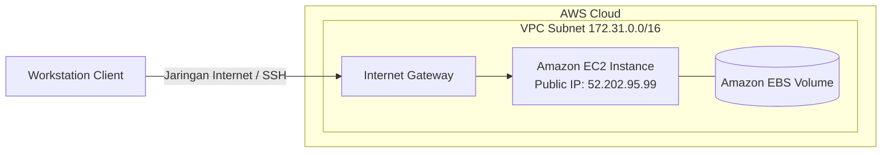

# Analisis Perbandingan Manajemen Konfigurasi Menggunakan Ansible dan Shell Script Pada Cloud Server Deployment AWS

## Abstrak
Pemanfaatan teknologi cloud computing dalam pengembangan sebuah website memiliki perkembangan yang signifikan seperti penggunaan disk storage, memory, dan CPU yang berjalan di cloud memiliki biaya yang rendah jika dibandingkan dengan server fisik. Dalam hal membangun website membutuhkan interaksi manusia dalam melakukan proses deployment seperti membuat database dan instalasi paket yang dibutuhkan website, semua itu dilakukan dengan cara manual sehingga membutuhkan banyak waktu. Dibutuhkan proses otomasi untuk mengatasi masalah tersebut yang dapat menggunakan ansible dan shell script pada proses deployment website. Pada penelitian ini akan membandingkan ansible dan shell script sebagai manajemen konfigurasi deployment drupal ke server amazon web service EC2 dengan menganalisa waktu proses deployment, penggunaan CPU dan memory pada server, throughput, dan packet loss. Berdasarkan pengujian yang telah dilakukan shell script mengungguli ansible pada waktu proses deployment dengan perbedaan 3 menit, throughput yang dihasilkan dalam pengujian ansible lebih baik dengan rata-rata 60.164 Kb/s dan 22.009 Kb/s untuk shell script, dan penggunaan ansible terhadap CPU jauh lebih baik karena tidak membuat server terbebani.

**Kata Kunci:** Cloud Server, Amazon Web Service, Ansible, Shell Script

---

## Abstract
Utilization of cloud computing technology in the development of a website has significant developments such as the use of disk storage, memory, and CPUs running in the cloud at a low cost when compared to physical servers. When creates a website, human interaction in carrying out the deployment process such as creating a database and installing the packages needed by the website, all of this is done manually so it takes a lot of time. An automation process is needed to solve this problem by using ansible and shell scripts in the website deployment process. This final project will compare ansible and shell scripts as configuration management for drupal deployments to the Amazon web service EC2 server by analyzing the deployment process time, CPU and memory usage on the server, throughput, and packet loss. Based on tests that shell scripts have performed outperformed ansible at deployment time with a difference of 3 minutes, throughput generated in ansible testing is better with an average of 60,164 Kb/s and 22,009 Kb/s for shell scripts, and ansible usage against the CPU is much better because it does not make the server overloaded.

**Keyword:** Cloud Server, Amazon Web Service, Ansible, Shell Script

---

## 1. Pendahuluan
Pemanfaatan teknologi *cloud computing* dalam pengembangan website memiliki perkembangan yang signifikan. Penggunaan *disk storage*, memori, dan CPU yang berjalan di *cloud* memiliki biaya operasional yang lebih rendah jika dibandingkan dengan server fisik. Pengguna layanan *cloud* tidak perlu memikirkan biaya perawatan perangkat keras karena telah ditangani oleh penyedia layanan.

Penggunaan website pada perusahaan atau instansi sebagai media informasi memerlukan manajemen konten dan pembuatan yang efisien, salah satunya dengan Content Management System (CMS) seperti Drupal. Namun, pembangunan website secara manual memerlukan interaksi manusia untuk proses *deployment* seperti membuat database dan menginstal paket dependen, yang memakan waktu cukup lama.

Dalam dunia Teknologi Informasi, manajemen konfigurasi merupakan proses membangun, mengubah, serta mengelola sistem server secara otomatis. Dua metode populer untuk mengotomatisasi konfigurasi ini adalah **Ansible** (sebagai *Configuration Management Tool*) dan **Shell Script** (skrip Bash). Penelitian ini membandingkan kinerja kedua pendekatan tersebut dalam men-deploy CMS Drupal pada server Amazon Web Services (AWS) EC2.

### 1.1 Manajemen Konfigurasi
Manajemen konfigurasi bertujuan untuk mempermudah pengelolaan dan pengontrolan infrastruktur hardware, software, dan perangkat lainnya guna menghasilkan performa yang konsisten dan stabil serta mengurangi potensi *human error*.

### 1.2 Amazon Web Services (AWS)
AWS menyediakan sumber daya komputasi secara *pay-as-you-go*. Layanan utama yang digunakan dalam pengujian ini meliputi:
* **Amazon EC2 (Elastic Compute Cloud):** Menyediakan kapasitas server virtual yang dapat dikonfigurasi dengan cepat.
* **Amazon VPC (Virtual Private Cloud):** Mengatur keamanan dan konfigurasi jaringan virtual terisolasi.
* **Amazon EBS (Elastic Block Store):** Menyediakan volume penyimpanan blok yang persisten untuk instansi EC2.

### 1.3 Ansible
Ansible adalah CMT (*Configuration Management Tool*) bersifat *open-source* yang dikembangkan oleh Michael DeHaan pada tahun 2012 dan diakuisisi oleh Red Hat pada tahun 2015. Keunggulan Ansible:
* **Clear:** Menggunakan sintaks YAML yang mudah dipahami manusia.
* **Fast:** Bekerja secara *agentless* (tanpa memerlukan agen tambahan di server).
* **Efficient:** Menghemat sumber daya penyimpanan karena modul bekerja melalui JSON.
* **Secure:** Menggunakan SSH untuk komunikasi antar server.

### 1.4 Shell Script (BASH)
Shell script merupakan sekumpulan perintah shell Bash yang dimasukkan ke dalam sebuah berkas teks berekstensi `.sh`. Bash shell mengimplementasikan standar POSIX untuk pengolahan parameter, variabel, dan pengalihan aliran (*redirection*). Metode ini sangat ringan karena menggunakan perkakas bawaan sistem operasi Linux.

### 1.5 Cloud Computing
*Cloud computing* merupakan model komputasi berbasis internet yang memungkinkan akses *on-demand* terhadap sumber daya komputasi bersama seperti server, penyimpanan, dan aplikasi tanpa banyak interaksi langsung dengan penyedia layanan.

---

## 2. Metode Penelitian
Penelitian ini dirancang melalui tahapan berikut:
1. **Studi Literatur:** Mengumpulkan data pendukung dari buku, jurnal, dan dokumentasi resmi.
2. **Implementasi dan Simulasi:** Menulis skrip otomatisasi (Playbook YAML untuk Ansible dan skrip Bash untuk Shell Script) untuk instalasi Drupal di AWS EC2.
3. **Pengujian dan Analisis:** Menguji kinerja sistem berdasarkan parameter:
   * **Throughput:** Jumlah data sukses yang dikirim melalui jaringan (diukur menggunakan Wireshark).
   * **Penggunaan CPU & Memori:** Memantau utilisasi sumber daya server menggunakan alat bantu Netdata.
   * **Packet Loss:** Persentase paket data yang hilang selama transmisi (diukur menggunakan Wireshark).
   * **Waktu Proses Deployment:** Menghitung total durasi eksekusi instalasi paket web server dan Drupal.
4. **Penyimpulan Hasil:** Menarik kesimpulan perbandingan performa.

---

## 3. Hasil dan Pembahasan

### 3.1 Arsitektur Topologi Cloud
Topologi cloud diimplementasikan pada Virtual Private Cloud (VPC) AWS. Workstation penguji terhubung ke server EC2 menggunakan jalur internet melalui protokol SSH (port 22).

### 3.2 Skenario Pengujian
Pengujian dilakukan dengan menjalankan Ansible Playbook dan Shell Script untuk instalasi web server dan Drupal. Eksperimen diulang sebanyak 5 kali (total 10 percobaan) pada satu instance server EC2 yang bersih (dihapus dan dibuat ulang setiap selesai satu percobaan untuk menjaga kebersihan sistem operasi).

---

### 3.3 Analisis Parameter Uji

#### 3.3.1 Kecepatan Deployment
Mengukur total waktu yang dibutuhkan oleh masing-masing metode hingga CMS Drupal siap digunakan.

##### Tabel 1: Kecepatan Deployment (Format: jam:menit:detik:milidetik)
| Percobaan Ke- | Ansible Playbook | Shellscript (BASH) |
| :---: | :--- | :--- |
| 1 | 0:05:44:986 | 0:02:05:295 |
| 2 | 0:05:29:865 | 0:02:02:174 |
| 3 | 0:05:37:739 | 0:04:04:515 |
| 4 | 0:05:45:037 | 0:02:01:088 |
| 5 | 0:06:00:978 | 0:02:07:160 |
| **Rata-rata** | **~5 menit 43 detik** | **~2 menit 28 detik** |

*Analisis:* Shell Script rata-rata lebih cepat sekitar 3 menit dibanding Ansible. Hal ini disebabkan karena Shell Script mengeksekusi instruksi langsung pada shell sistem tanpa adanya overhead pemrosesan sintaks YAML, kalkulasi dependensi, dan pertukaran modul berbasis JSON yang dimiliki oleh Ansible.

#### 3.3.2 Penggunaan CPU Server
Mengamati titik puncak penggunaan CPU tertinggi di server target selama proses *deployment* berlangsung.

##### Tabel 2: Penggunaan CPU Tertinggi
| Percobaan Ke- | Ansible (%) | Shell Script (%) |
| :---: | :---: | :---: |
| 1 | 90.0% | 92.1% |
| 2 | 92.0% | 94.0% |
| 3 | 92.0% | 89.0% |
| 4 | 91.1% | 91.9% |
| 5 | 94.9% | 92.9% |
| **Rata-rata** | **92.0%** | **91.8%** |

*Analisis:* Tidak terdapat perbedaan performa CPU yang signifikan antara kedua metode (selisih rata-rata hanya 0,2%). Keduanya membebani CPU hingga rata-rata ~92% karena melakukan proses kompilasi dan ekstraksi paket Drupal yang cukup intensif.

#### 3.3.3 Penggunaan Memory Server
Memantau puncak penggunaan kapasitas memori tertinggi pada RAM server EC2.

##### Tabel 3: Penggunaan Memory Tertinggi
| Percobaan Ke- | Ansible (MiB) | Shell Script (MiB) |
| :---: | :---: | :---: |
| 1 | 839.9 | 834.7 |
| 2 | 809.9 | 798.3 |
| 3 | 826.0 | 837.6 |
| 4 | 800.1 | 807.8 |
| 5 | 801.6 | 806.8 |
| **Rata-rata** | **815.5 MiB** | **817.0 MiB** |

*Analisis:* Penggunaan memori dari kedua perkakas hampir serupa (selisih rata-rata hanya ~1,5 MiB). Kedua metode menuntut alokasi memori yang stabil untuk menjalankan proses *daemon* instalasi paket apt-get.

#### 3.3.4 Throughput Jaringan
Throughput mengukur kecepatan pengiriman data efektif (transfer rate) selama proses *deployment* yang dipantau melalui Wireshark.

##### Tabel 4: Hasil Perbandingan Throughput
| Percobaan Ke- | Ansible (Kb/s) | Shellscript (BASH) (Kb/s) |
| :---: | :---: | :---: |
| 1 | 60.040 | 23.896 |
| 2 | 62.520 | 25.288 |
| 3 | 61.064 | 13.000 |
| 4 | 59.784 | 24.072 |
| 5 | 57.416 | 23.792 |
| **Rata-rata** | **60.164** | **22.009** |

*Analisis:* Ansible mencatatkan throughput yang jauh lebih besar (rata-rata 60,16 Kb/s) dibandingkan Shell Script (22,01 Kb/s). Hal ini dikarenakan mekanisme paralel dan buffering transfer paket Ansible via SSH jauh lebih optimal.

#### 3.3.5 Packet Loss
Mengukur tingkat kegagalan pengiriman paket data selama proses deployment.

$$\text{Packet Loss} = \frac{\text{Paket Dikirim} - \text{Paket Diterima}}{\text{Paket Dikirim}} \times 100\%$$

##### Tabel 5: Hasil Perbandingan Packet Loss
| Percobaan Ke- | Ansible (%) | Shellscript (BASH) (%) |
| :---: | :---: | :---: |
| 1 | 0.066% | 0.096% |
| 2 | 0.045% | 0.063% |
| 3 | 0.067% | 0.095% |
| 4 | 0.088% | 0.065% |
| 5 | 0.066% | 0.482% |
| **Rata-rata** | **0.066%** | **0.160%** |

*Analisis:* Ansible memiliki persentase packet loss yang lebih kecil (rata-rata 0,066%) dibandingkan Shell Script (rata-rata 0,160%). Protokol SSH enkapsulasi yang digunakan oleh Ansible lebih andal dalam meminimalkan hilangnya data jaringan.

---

## 4. Kesimpulan
Berdasarkan hasil pengujian yang telah dilakukan, dapat disimpulkan beberapa poin sebagai berikut:
1. **Fungsionalitas:** Baik Ansible maupun Shell Script mampu melakukan otomatisasi *deployment* Drupal pada AWS EC2 dengan sukses.
2. **Kecepatan:** Shell Script mengungguli Ansible dengan kecepatan eksekusi yang lebih cepat (selisih rata-rata ~3 menit), karena eksekusinya langsung dan tanpa overhead sistem CMT.
3. **Kualitas Layanan Jaringan (QoS):** Ansible mengungguli Shell Script secara signifikan dalam parameter jaringan, dengan throughput rata-rata lebih besar (60,16 Kb/s vs 22,01 Kb/s) dan tingkat packet loss yang lebih rendah (0,066% vs 0,160%).
4. **Utilisasi Sumber Daya:** Penggunaan CPU (~92%) dan memori RAM (~815 MiB) dari kedua perkakas tidak menunjukkan perbedaan yang signifikan selama proses instalasi Drupal.

---

## Daftar Pustaka
1. R. Attaufiq, “CONFIGURATION MANAGEMENT SYSTEM CMS PADA PT RADIANT UTAMA INTERINSCO,” UIN Syarif Hidayatullah Jakarta, 2014.
2. Y. Kurniawan, *Ansible for AWS: A simple way to provision and manage your Amazon Cloud infrastructure*. Leanpub, 2016.
3. S. Mathew, “Overview of Amazon Web Services (Survey Report),” 2014. http://media.amazonwebservices.com/AWS_Overview.pdf.
4. D. Tsumak, “Large-Scale Provisioning and Configuration Management,” UNIVERSITY OF TARTU, 2016.
5. I. M. B. Swastika and I. G. O. G. Atitama, “Otomatisasi Konfigurasi Mikrotik Router Menggunakan Software Ansible,” *Internet Think Big Data Teknol. Tantangan dan Peluang*, pp. 495–502, 2017.
6. J. Geerling, *Ansible for DevOps: Server and configuration management for humans*. Leanpub, 2015.
7. A. A. Slameto and Lukman, “Penerapan Openssh Dan Bash Script Untuk Simultaneous Remote Access Client Pada Laboratorium Stmik Amikom Yogyakarta,” *Teknol. Inf.*, vol. IX, no. 27, pp. 23–32, 2014.
8. C. Ramey and B. Fox, *Bash Reference Manual - Reference Documentation for Bash Edition 5.0, for Bash Version 5.0.*, Case Western Reserve University & Free Software Foundation, 2019. https://www.gnu.org/software/bash/manual/bash.pdf.
9. P. Mell and T. Grance, “The NIST Definition of Cloud Computing,” Recommendations of the National Institute of Standards and Technology, 2011. https://nvlpubs.nist.gov/nistpubs/Legacy/SP/nistspecialpublication800-145.pdf.
10. A. R. Hakim, “Analisis Perbandingan Sistem Cloud Azure Dan Google Cloud,” *InfoTekJar (Jurnal Nas. Inform. dan Teknol. Jaringan)*, vol. 1, no. 1, pp. 38–41, 2016, doi: 10.30743/infotekjar.v1i1.38.
