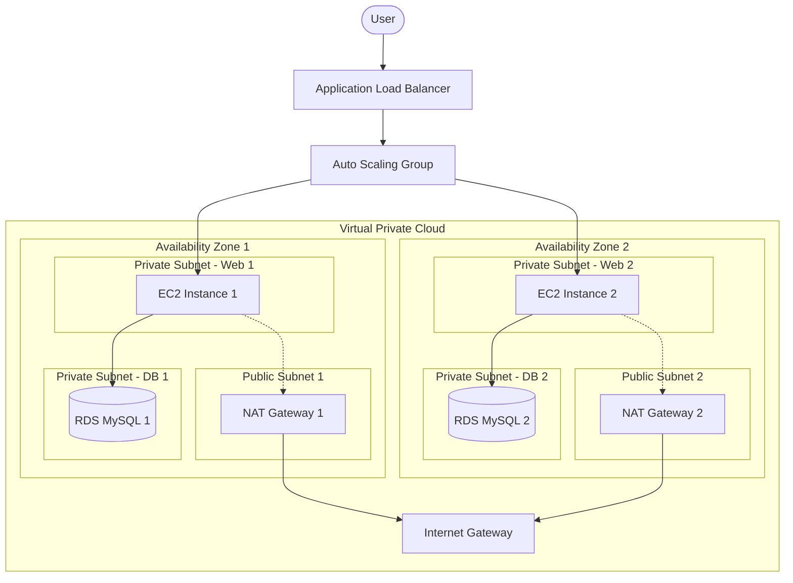

# A Controlled Comparative Evaluation of Infrastructure as Code Tools: Deployment Performance and Maintainability Across Terraform, Pulumi, and AWS CloudFormation

## Abstract
Infrastructure as Code (IaC) underpins automated cloud provisioning in modern DevOps environments; however, controlled comparative evaluations of leading IaC tools under identical conditions remain limited. This study presents a controlled comparative evaluation of Terraform, Pulumi, and AWS CloudFormation within a standardized Amazon Web Services (AWS) environment. An identical multi-tier architecture was implemented using each tool, and repeated deployment cycles were conducted to observe differences in provisioning duration, removal time, structural maintainability, and operational characteristics. Descriptive statistical analysis across 30 controlled repetitions indicates that Terraform and Pulumi achieve comparable deployment performance, whereas CloudFormation requires more than twice the average provisioning time under the conditions evaluated. Removal durations were similar across tools but remained longest for CloudFormation. Structural analysis reveals trade-offs between declarative modular design, programmatic flexibility, and native cloud integration. The study provides a controlled, comparative framework to support evidence-based selection of IaC tools in production-oriented cloud environments.

---

## 1. Introduction
Contemporary software systems rely on automated, reproducible infrastructure provisioning to maintain continuous delivery, swift scalability, and operational resilience. IaC facilitates automation by specifying infrastructure using version-controlled, machine-readable artifacts that seamlessly interface with DevOps processes. As cloud environments become more complex, the operational consequences of IaC tooling choices become increasingly critical. In distributed cloud systems, orchestration latency and provisioning determinism directly influence pipeline throughput, recovery time objectives, and infrastructure elasticity.

Terraform, Pulumi, and AWS CloudFormation are three prevalent IaC solutions with distinct design principles. Terraform uses a declarative domain-specific language (HCL); Pulumi uses general-purpose programming languages (Python in this study) to define infrastructure; and CloudFormation offers a native managed service closely integrated with the AWS ecosystem. While each tool may offer functionally comparable designs, their operational attributes vary in terms of deployment delay, failure management, and maintainability.

Notwithstanding their widespread industrial use, comprehensive quantitative evaluations of these instruments remain limited. Many current evaluations rely on qualitative analysis, limited experimentation, or anecdotal evidence. Few studies employ replication across multiple operational dimensions. As a result, current comparisons are often not generalizable and offer less decision-making support for practitioners. The selection of IaC tools significantly affects deployment efficiency and long-term maintainability; thus, the lack of controlled, multifaceted empirical evaluation limits the depth of evidence available to support performance-sensitive decision-making in applied cloud engineering research.

This study addresses this gap by conducting a controlled comparative evaluation of Terraform, Pulumi, and AWS CloudFormation under defined conditions within AWS. An identical multi-tier web application architecture was implemented using each tool, and each configuration was deployed and dismantled 30 times. Descriptive statistical analysis across the repeated cycles quantified distributional characteristics, including variability and dispersion patterns. Deployment performance, stability indicators, and maintainability characteristics were observed and compared under standardized conditions.

The subsequent inquiries direct the research:
- **RQ1:** How do the tools differ in observed operational efficiency in regulated cloud deployments?
- **RQ2:** Does the IaC paradigm meaningfully influence maintainability attributes and deployment stability?

Operational efficiency primarily concerns deployment duration and removal performance under controlled conditions, whereas maintainability and stability pertain to the code’s structural characteristics and failure behavior during deployment. The contributions of this study are:
1. A comparative evaluation of three widely used IaC tools under identical architectural and environmental conditions.
2. Observed differences in deployment and removal performance across tools.
3. A structured analysis of maintainability and operational characteristics across declarative, programmatic, and native cloud paradigms.
4. A transparent methodological framework supporting reproducible comparative studies in cloud infrastructure engineering.

---

## 2. Related Works
Research on Infrastructure as Code has increased significantly over the last five years, with a focus on defect characterization, security analysis, test automation, governance standards, and tool benchmarking. Nonetheless, methodologically rigorous, multidimensional empirical evaluations of prominent IaC methods remain few.

Numerous studies have investigated problem patterns and quality characteristics of Infrastructure as Code scripts. Rahman et al. categorized systematic defects in configuration artifacts, revealing that IaC scripts exhibit fault distributions that differ from those of conventional application code [1]. Subsequent research expanded this technique to defect prediction, demonstrating that structural and process measurements can pinpoint error-prone components of infrastructure [2]. Extensive empirical studies have confirmed associations between product metrics and defect susceptibility in Infrastructure-as-Code repositories [3]. Although these contributions enhance understanding of script-level quality, they primarily assess static attributes rather than runtime performance under controlled deployment conditions.

Security research has identified structural vulnerabilities in infrastructure definitions. Fischer et al. introduced static analysis methods to identify vulnerabilities in Infrastructure-as-Code setups, revealing prevalent misconfigurations in real-world repositories [4]. Expanded vulnerability taxonomies enhanced previous classifications and recorded persistent misconfiguration patterns within Infrastructure as Code ecosystems [5]. While these studies enhance security assurance methods, they do not evaluate the efficacy of comparable tools and therefore cannot guide performance-sensitive tool selection decisions.

The testing and validation of IaC programs constitute a significant area of ongoing research. Sokolowski et al. presented automated testing methodologies specifically designed for IaC settings and supplied curated datasets that facilitate reproducible large-scale analyses [6,7]. Comprehensive studies of Infrastructure as Code lifecycle management have highlighted governance frameworks, modularization techniques, and quality assurance in DevOps pipelines [8]. These initiatives improve reliability engineering but fail to thoroughly evaluate the operational attributes of rival IaC models.

The investigation of operational efficiency in cloud automation has also been conducted. Sharma et al. showed that infrastructure provisioning latency directly affects CI/CD throughput and overall system responsiveness [9]. Investigations into configuration quality measurements have further delineated quantifiable correlations between code structure and maintainability results [10]. Enterprise-focused frameworks for multi-cloud IaC adoption prioritize modular architecture and policy-as-code implementation to enhance governance and operational uniformity [11]. Nevertheless, these studies generally lack controlled experimental replication when assessing particular IaC approaches.

Comparative assessments of Infrastructure as Code tools are limited and methodologically restricted. Vaggu delineated the trade-offs between Terraform and Pulumi in terms of extensibility and provisioning behavior [12], whereas other analyses compared Terraform with CloudFormation from architectural and ecosystem perspectives [13]. Numerous comparative studies rely on limited deployment cycles, descriptive analyses, or single-metric evaluations. Formal statistical modeling and effect size reporting remain relatively uncommon in comparative IaC evaluations.

Recent studies have investigated AI-enhanced IaC generation and infrastructure reconciliation. The Multi-IaC-Eval benchmark assessed automated template synthesis across many formats, uncovering semantic and validation issues in model-driven infrastructure production [14]. AI-driven reconciliation agents have examined the automated identification and rectification of configuration drift [15]. Although these advancements pertain to automation processes, they do not eliminate the necessity for controlled, methodically rigorous comparisons of existing production tools.

A recent study has investigated the growing operational and lifecycle challenges associated with deploying Infrastructure as Code. Empirical studies on IaC dependency management reveal that infrastructure configurations often experience technical delays due to postponed module upgrades, which can last several months in ongoing projects [16]. Simultaneously, research has investigated automated methods to enhance the dependability and security of Infrastructure as Code settings. Automated threat-modeling frameworks like TerrARA analyze Terraform configuration files to generate infrastructure models and systematically detect potential security issues in cloud deployments [17]. Frameworks like InfraFix demonstrate that automated program-repair methodologies can effectively detect and rectify configuration errors in Infrastructure as Code (IaC) scripts, achieving high repair success rates [18]. Recent research on infrastructure automation in cloud-native data platforms underscores that modular architectures, enhanced state management systems, and cohesive dependency management can markedly enhance operational reliability and scalability [19].

---

## 3. Materials and Methods
The experimental framework was used to assess operational variances across IaC tools. The study aimed to isolate tool-specific effects under controlled conditions while ensuring methodological rigor, measurement precision, and reproducibility.

### 3.1. Experimental Design
A controlled repeated-deployment experimental design was employed. The primary comparison factor was the selected IaC tool:
- Terraform 1.12.2
- Pulumi 3.186.0
- AWS CloudFormation

Measured characteristics included deployment performance, stability, and maintainability. Every configuration was deployed and destroyed 30 times, yielding 90 total experimental runs. Each cycle began from a fully cleared cloud state to minimize cross-run interference.

All experiments were conducted:
- Within the same AWS account;
- In the same region (`eu-central-1`);
- Using identical credentials and permission levels;
- From a dedicated Fedora Linux virtual machine;
- Over a stable wired network connection.
- Without concurrent provisioning tasks.

### 3.2. Infrastructure Specification
The assessed architecture emulated a production-level web application environment comprising:
- Virtual Private Cloud (VPC);
- Public and private subnets spanning two Availability Zones;
- Internet Gateway and dual NAT Gateways;
- Application Load Balancer (ALB);
- Auto Scaling Group of EC2 Instances;
- Amazon RDS MySQL Database.



All resource characteristics were standardized. The definitions of infrastructure varied solely in the syntactic representation each tool mandated. Interdependent components (e.g., NAT readiness before instance initialization) were included to replicate authentic operational complexity.

### 3.3. Operational Variables and Measurement Definitions

#### 3.3.1. Evaluating Deployment Performance
The subsequent temporal metrics were documented:
- **Initialization time:** The delay from command initiation to tool initialization.
- **Planning time:** The duration necessary to compute the execution plan.
- **Provisioning time:** The interval between execution confirmation and the complete readiness of the infrastructure.
- **Destruction time:** The period necessary for total resource dismantlement.
- **Total deployment duration:** The elapsed time from provisioning command initiation to application availability.

To ensure consistency, Unix timestamps were collected immediately before and after each operational phase using automated shell scripts. All measurements were acquired in the same execution environment to eliminate clock drift.

#### 3.3.2. Stability
Stability was assessed utilizing:
- Binary failure event during provisioning;
- Existence of partial deployment states;
- Errors in dependency resolution.

#### 3.3.3. Maintainability
Maintainability was evaluated through a structured comparison of configuration organization, modular decomposition, and code verbosity across tools. The following aspects were considered:
- Degree of modular separation of infrastructure components;
- Reusability structure (presence of reusable modules or classes);
- Configuration verbosity and structural clarity.

Terraform implementations employed modular HCL definitions with centralized variable management. Pulumi structured infrastructure using Python 3.12.11 classes representing logical units. CloudFormation relied on YAML templates and nested stacks.

### 3.4. Experimental Protocol
Every deployment cycle adhered to a uniform protocol:
1. Validation of an unoccupied AWS environment;
2. Initialization of the tool;
3. Execution of the deployment command;
4. Oversight until verified operational readiness;
5. Documentation of temporal metrics;
6. Complete infrastructure devastation;
7. Validation of comprehensive cleanup.

### 3.5. Analytical Approach
Descriptive statistics were computed from the collected measurements, including mean values, standard deviation, range, skewness, and kurtosis, to characterize the distribution of observed deployment durations.

---

## 4. Results

### 4.1. Deployment Performance

#### 4.1.1. Infrastructure Provisioning Time
The average time required to provide the complete multi-tier infrastructure is presented in Table 1.

##### Table 1: Average infrastructure provisioning time.
| Tool | Average Provisioning Time |
| :--- | :--- |
| **Terraform** | 4 min 15 s (253 s) |
| **Pulumi** | 4 min 37 s (279 s) |
| **CloudFormation** | 10 min 18 s (623 s) |

Terraform exhibited a mean provisioning time of 253.33 s (SD = 8.42), while Pulumi averaged 279.37 s (SD = 9.89). CloudFormation showed substantially longer provisioning times with greater variability (mean = 622.97 s, SD = 29.92). Distributional analysis indicates stable execution for Terraform and Pulumi (skewness < 0.2), whereas CloudFormation displayed higher skewness and kurtosis, suggesting occasional longer provisioning events.

Expressed as relative performance:
- CloudFormation required approximately **2.4×** the provisioning time of Terraform.
- CloudFormation required approximately **2.2×** the provisioning time of Pulumi.

##### Table 2: Statistical analysis of the infrastructure deployment phase.
| Tool | Mean (s) | Median | SD | Variance | Min | Max | Range | Skewness | Kurtosis |
| :--- | :---: | :---: | :---: | :---: | :---: | :---: | :---: | :---: | :---: |
| **Terraform** | 253.33 | 254.5 | 8.42 | 70.85 | 242 | 271 | 29 | 0.20 | -1.05 |
| **Pulumi** | 279.37 | 278.5 | 9.89 | 97.90 | 264 | 297 | 33 | 0.17 | -1.15 |
| **CloudFormation**| 622.97 | 615.0 | 29.92 | 895.41 | 587 | 722 | 135 | 1.44 | 2.75 |

#### 4.1.2. Infrastructure Removal Time
All tools required slightly more time to remove infrastructure than to provision it, as described in Table 3.

##### Table 3: Average infrastructure removal time.
| Tool | Average Removal Time |
| :--- | :--- |
| **Terraform** | 7 min 42 s (462 s) |
| **Pulumi** | 8 min 37 s (517 s) |
| **CloudFormation** | 9 min 35 s (575 s) |

Terraform exhibited a mean destruction time of 466.23 s (SD = 23.98), Pulumi 513.73 s (SD = 30.68), and CloudFormation 578.40 s (SD = 49.52), indicating progressively increasing variability across tools. Removal durations were more similar across tools than provisioning times, although CloudFormation remained the slowest overall.

---

### 4.2. Code Structure and Maintainability

#### 4.2.1. Structural Modularity
All tools facilitated the decomposition of infrastructure into logical components (VPC, NAT, ALB, security groups, web, database).
- **Terraform** utilized six distinct HCL modules (vpc, nat, alb, sec_group, web, database), each in its own directory and managed by a single orchestration file.
- **Pulumi** achieved similar logical separation using Python `ComponentResource` classes. Every infrastructure layer was encased behind a reusable class abstraction.
- **CloudFormation** achieved modularization using nested YAML stacks managed via a master template. However, cross-stack parameter transmission and template verbosity increased structural complexity.

#### 4.2.2. Abstraction and Reusability
- **Terraform** prioritizes declarative precision via HCL modules. The restricted imperative constructs reduce logical complexity while maintaining a consistent infrastructure specification.
- **Pulumi** leverages the full features of Python (loops, functions, classes, external integrations), offering significant flexibility in abstraction, though it may entail higher cognitive burden.
- **CloudFormation** depends on declarative YAML templates. Reuse is achieved through nested stacks; however, the flexibility of abstraction is constrained without external frameworks like AWS CDK.

#### 4.2.3. Management of State and Operational Resilience
- **Terraform** used a remote S3 backend with state locking, ensuring transparency and collaborative security, but requiring setup discipline.
- **Pulumi** used centralized cloud-state storage with versioning. Dependency resolution was predominantly automated.
- **CloudFormation** internally handles state via AWS stack techniques. An important operational feature was automatic rollback in the event of provisioning failure.

##### Table 4: Structured maintainability comparison of evaluated IaC tools.
| Dimension | Terraform | Pulumi | AWS CloudFormation |
| :--- | :--- | :--- | :--- |
| **Modularity mechanism** | Separate HCL modules per infrastructure layer | ComponentResource class-based modularity | Nested YAML stacks |
| **Separation of concerns**| Directory-based module isolation | Encapsulated class abstractions | Logical segmentation via stack templates |
| **Abstraction level** | Declarative with limited imperative constructs | Full programming language expressiveness | Declarative template-based |
| **Reusability model** | Module reuse via variables and outputs | Class reuse and programmable abstractions | Nested stack reuse |
| **Dependency handling** | Explicit when required (`depends_on`) | Primarily automatic with optional enforcement | Stack-based automatic resolution |
| **State management** | External state (S3 backend with locking) | Centralized service-based state | AWS-managed stack state |
| **Rollback capability** | Manual recovery required | Manual recovery required | Built-in automatic rollback |
| **Configuration verbosity**| Moderate | Moderate (implementation-dependent) | High in complex templates |
| **Maintainability orientation**| Structured declarative modularity | High abstraction flexibility | Robust native integration with higher verbosity |

#### 4.2.4. Maintainability Synthesis
The maintainability trade-offs were predominantly influenced by abstraction philosophy and state management architecture. Terraform emphasizes declarative, modular organization and explicit state management. Pulumi highlights the flexibility of programmatic abstraction. CloudFormation offers robust AWS-native state management and rollback capabilities, but with increased verbosity.

### 4.3. Operational Usability Observations
Terraform and Pulumi use concise command-line interfaces to plan, apply, and destroy infrastructure. CloudFormation requires longer command syntax with multiple parameters for stack management and output inspection.

Examples of common deployment commands used by each tool:
- **Terraform:**
  ```bash
  terraform init
  terraform plan
  terraform apply
  ```
- **Pulumi:**
  ```bash
  pulumi preview
  pulumi up
  ```
- **CloudFormation:**
  ```bash
  aws cloudformation deploy --template-file template.yaml --stack-name demo-stack
  ```

### 4.4. Summary of Observed Differences
Under identical conditions:
1. Terraform and Pulumi demonstrated comparable provisioning performance.
2. CloudFormation required more than double the provisioning time.
3. Removal durations were similar across tools but remained longest for CloudFormation.
4. Terraform exhibited more concise modular definitions under the implemented architecture.
5. Pulumi offered the highest programmatic flexibility.
6. All three tools successfully provisioned the target infrastructure without persistent configuration inconsistencies.

---

## 5. Discussion

### 5.1. Scope of Experimentation and Architectural Representativeness
The assessment utilized a singular production-representative multi-tier web architecture. It does not cover the full range of potential cloud deployment scenarios, such as serverless, container orchestration systems, event-driven architectures, or deployments across multiple regions.

### 5.2. Specificity of Cloud Providers
All trials were performed within AWS. The native integration of CloudFormation may affect deployment behavior in varying ways across distinct resource types. Results should not be generalized to other cloud providers (Azure, GCP) without further controlled assessment.

### 5.3. Comparative Methodology
The analytical focus was on reliable, controlled comparisons and practical significance under uniform infrastructure settings. Inferential modeling could further refine statistical interpretation, but the study prioritizes controlled engineering comparison.

### 5.4. Environmental and Temporal Limitations
API latency and performance fluctuate over time due to provider load and throttling. While the repeated-deployment methodology mitigates transient abnormalities, the study does not account for long-term temporal variability.

### 5.5. Limitations of Maintainability Assessment
The study evaluated visible structural aspects and code verbosity, but formal static code metrics (e.g., cyclomatic complexity, dependency graphs) and socio-technical factors (team cohesion, learning curve) were not calculated.

### 5.6. Security and Compliance Considerations
- Terraform and Pulumi facilitate policy-as-code frameworks (e.g., Open Policy Agent, Sentinel) to validate infrastructure configurations before deployment.
- AWS CloudFormation offers native integration with IAM, encryption services, and stack-level access policies, as well as automatic rollback in the event of deployment failure.

### 5.7. Usability and Qualitative Observations
Ergonomic conclusions ought to be regarded as practitioner-informed insights rather than empirically substantiated usability results.

### 5.8. Risks to External Validity
External validity is constrained by the single-cloud-provider environment, unified infrastructure topology, unified execution environment, and specific tool versions assessed.

---

## 6. Conclusions and Future Work
This study conducted a controlled comparative assessment of Terraform, Pulumi, and AWS CloudFormation. The results indicate that Terraform and Pulumi exhibit similar provisioning efficiency, whereas CloudFormation requires significantly longer deployment times. Removal durations were more consistent, though CloudFormation remained the slowest.

Selecting IaC tools affects operational deployment dynamics and configuration architecture. Terraform focuses on modular, declarative composition; Pulumi provides programmatic abstraction and flexibility; and CloudFormation offers robust native integration, but with higher verbosity.

Future studies should expand this framework to multi-cloud environments, containerized/serverless workloads, and long-term longitudinal performance analyses.

---

## Appendix A: Destruction Phase Statistics

##### Table A1: Statistical analysis of the infrastructure destruction phase.
| Tool | Mean (s) | Median | SD | Variance | Min | Max | Range | Skewness | Kurtosis |
| :--- | :---: | :---: | :---: | :---: | :---: | :---: | :---: | :---: | :---: |
| **Terraform** | 466.23 | 464.0 | 23.98 | 575.08 | 427 | 527 | 100 | 0.60 | 0.35 |
| **Pulumi** | 513.73 | 511.0 | 30.68 | 941.03 | 428 | 569 | 141 | -0.50 | 0.75 |
| **CloudFormation**| 578.40 | 573.0 | 49.52 | 2452.04 | 488 | 720 | 232 | 0.76 | 1.15 |

---

## References
1. Rahman, A.; Williams, L. Characterizing Defective Configuration Scripts Used for Continuous Deployment. In *Proceedings of the 2018 IEEE 11th International Conference on Software Testing, Verification and Validation (ISCT)*; IEEE: New York, NY, USA, 2018; pp. 34–45.
2. Dey, T.; Mockus, A. Effect of Technical and Social Factors on Pull Request Quality for the NPM Ecosystem. In *Proceedings of the 14th ACM/IEEE International Symposium on Empirical Software Engineering and Measurement (ESEM)*; IEEE: New York, NY, USA, 2020; pp. 1–11.
3. Dalla Palma, S.; Di Nucci, D.; Palomba, F.; Tamburri, D.A. Within-Project Defect Prediction of Infrastructure as Code Using Product and Process Metrics. *IEEE Trans. Softw. Eng.* 2022, 48, 2086–2104.
4. Fischer, M.; et al. Static Analysis of Infrastructure as Code Setups. In *Proceedings of the 2022 IEEE 19th International Conference on Software Architecture Companion (ICSA-C)*; IEEE: New York, NY, USA, 2022; pp. 218–225.
5. War, A.; Nikiema, S.L.; Samhi, J.; Klein, J.; Bissyande, T.F. Security smells in infrastructure as code: A taxonomy update beyond the seven sins. *arXiv* 2025, arXiv:2509.18761.
6. Sokolowski, D.; Spielmann, D.; Salvaneschi, G. Automated Infrastructure as Code Program Testing. *IEEE Trans. Softw. Eng.* 2024, 50, 1585–1599.
7. Sokolowski, D.; Spielmann, D.; Salvaneschi, G. The PIPr Dataset of Public Infrastructure as Code Programs. In *Proceedings of the 21st International Conference on Mining Software Repositories*; ACM: New York, NY, USA, 2024; pp. 498–503.
8. Pahl, C.; Gunduz, N.; Sezen, Ö.; Ghamgosar, A.; El Ioini, N. Infrastructure as Code: Technology Review and Research Challenges. In *Proceedings of the 15th International Conference on Cloud Computing and Services Science*; SciTePress: Setúbal, Portugal, 2025; pp. 151–158.
9. Ganesan, P. DevOps Automation for Cloud Native Distributed Applications. *J. Sci. Eng. Res.* 2020, 7, 342–347.
10. Konala, P.R.R.; Kumar, V.; Bainbridge, D.; Haseeb, J. A Framework for Measuring the Quality of Infrastructure as Code Scripts. *arXiv* 2025, arXiv:2502.03127.
11. Dasari, H. Infrastructure as Code (IaC) Best Practices for Multi-Cloud Deployments in Enterprises. *Int. J. Netw. Secur.* 2025, 5, 174–186.
12. Vaggu, H. Automating Infrastructure as Code (IaC): A Comparative Study of Terraform, Pulumi, and Kubernetes Operators. *Int. J. AI Big Data Comput. Manag. Stud.* 2025, 6, 1–9.
13. Koneru, N.M.K. Infrastructure as Code (IaC) for Enterprise Applications: A Comparative Study of Terraform and CloudFormation. *Am. J. Technol.* 2025, 4, 1–29.
14. Davidson, S.; Sun, L.; Bhasker, B.; Callot, L.; Deoras, A. Multi-IaC-Eval: Benchmarking Cloud Infrastructure as Code Across Multiple Formats. *arXiv* 2025, arXiv:2509.05303.
15. Yang, Z.; Guan, H.; Nicolet, V.; Paulsen, B.; Dodds, J.; Kroening, D.; Chen, A. Automated Cloud Infrastructure as Code Reconciliation with AI Agents. *arXiv* 2025, arXiv:2510.20211.
16. Begoug, M.; Ouni, A.; Chouchen, M. How Do Infrastructure-as-Code Practitioners Update Their Dependencies? An Empirical Study on Terraform Module Updates. In *Proceedings of the 2025 IEEE/ACM 22nd International Conference on Mining Software Repositories (MSR)*; IEEE: New York, NY, USA, 2025; pp. 642–653.
17. Tran, A.-D.; Sion, L.; Yskout, K.; Joosen, W. TerrARA: Automated Security Threat Modeling for Infrastructure as Code. In *Proceedings of the Fifteenth ACM Conference on Data and Application Security and Privacy*; ACM: New York, NY, USA, 2024; pp. 269–280.
18. Saavedra, N.; Ferreira, J.F.; Mendes, A. InfraFix: Technology-Agnostic Repair of Infrastructure as Code. *arXiv* 2025, arXiv:2503.17220.
19. Dandolu, S. Srikanth Dandolu Infrastructure as Code for Cloud-Native Data Platforms: Automation and Best Practices. *J. Comput. Sci. Technol. Stud.* 2025, 7, 451–488.
