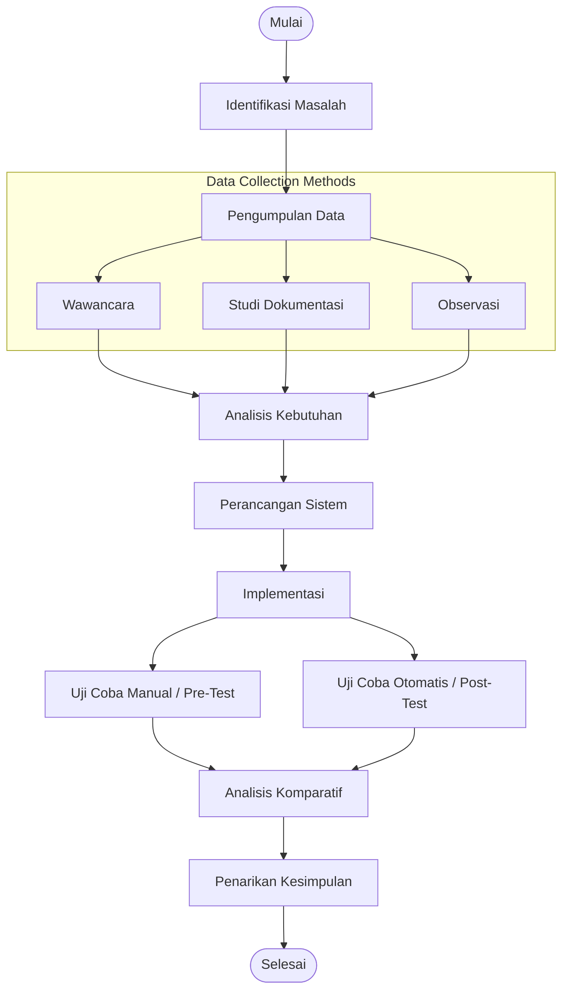

# Implementasi Sistem Otomatisasi Konfigurasi Server Berbasis Ansible dan Semaphore pada Infrastruktur TI Perusahaan Ritel

## Abstract
Manual configuration management of server infrastructure in retail companies with multiple branches often faces challenges related to time inefficiency and a high risk of human error. This study aims to implement an automated configuration system for DNS and NTP servers using the Infrastructure as Code (IaC) approach, utilizing Ansible as the automation tool and the Semaphore management interface. The research method employed is experimental with a Pre-test and Post-test Group design combined with performance testing and functional validation to compare the performance of manual (conventional) configuration and automated configuration. The results indicate a significant improvement in efficiency. In the single-server scenario, configuration time was reduced from 27 minutes to 8 minutes, achieving an efficiency improvement of 70.4%. A more substantial performance gain was observed in the large-scale implementation involving 14 servers, where the automation approach reduced the estimated configuration time from 378 minutes (manual method) to only 9 minutes through parallel execution, resulting in a time efficiency of 97.6%. In addition to improving speed, the proposed system standardizes configurations, eliminates technical errors, and facilitates centralized infrastructure monitoring.

---

## Abstrak
Manajemen konfigurasi infrastruktur server secara manual pada perusahaan ritel dengan banyak cabang sering kali menghadapi kendala efisiensi waktu dan tingginya risiko kesalahan manusia (*human error*). Penelitian ini bertujuan untuk mengimplementasikan sistem otomatisasi konfigurasi server DNS dan NTP menggunakan pendekatan *Infrastructure as Code* (IaC) dengan tools Ansible dan antarmuka manajemen Semaphore. Metode penelitian yang digunakan adalah eksperimental dengan desain *Pre-test and Post-test Group* serta pengujian kinerja (*performance testing*) dan validasi fungsional untuk membandingkan kinerja antara konfigurasi manual (konvensional) dan otomatisasi. Hasil pengujian menunjukkan peningkatan efisiensi yang signifikan. Pada skenario satu server, waktu konfigurasi berkurang dari 27 menit menjadi 8 menit dengan efisiensi sebesar 70,4%. Peningkatan kinerja yang lebih drastis terlihat pada implementasi skala luas (14 server), di mana metode otomatisasi mampu memangkas waktu dari estimasi 378 menit (metode manual) menjadi 9 menit berkat kemampuan eksekusi paralel, menghasilkan tingkat efisiensi waktu mencapai 97,6%. Selain kecepatan, sistem ini juga berhasil menstandarisasi konfigurasi, mengeliminasi kesalahan teknis, dan mempermudah pemantauan infrastruktur secara terpusat.

---

## 1. Pendahuluan
Di era modern ini, meningkatnya ketergantungan terhadap teknologi informasi menjadikan jaringan komputer sebagai komponen utama dalam mendukung operasional bisnis dan interaksi pengguna [1]. Infrastruktur jaringan yang handal memungkinkan pertukaran informasi yang cepat, kolaborasi tim yang efisien, serta penerapan sistem keamanan terintegrasi [2]. Dalam infrastruktur tersebut, terdapat layanan penting yang mendukung kelancaran komunikasi data, yaitu *Domain Name System* (DNS) dan *Network Time Protocol* (NTP). DNS berperan sebagai basis data terdistribusi yang menerjemahkan nama host (*hostname*) menjadi alamat IP untuk identifikasi perangkat [3]. Sementara itu, NTP berfungsi mensinkronkan waktu secara presisi di seluruh perangkat jaringan. Pada industri ritel, akurasi waktu dari NTP sangat dibutuhkan untuk memastikan validitas pencatatan log transaksi penjualan (*Point of Sales*) dan sinkronisasi data rekaman keamanan (CCTV) antar cabang agar tetap konsisten dan akurat [4].

Penelitian ini dilaksanakan pada salah satu perusahaan ritel berskala nasional di Indonesia yang memiliki jaringan cabang yang tersebar luas. Setiap cabang dituntut untuk mengelola infrastruktur teknologi informasi (TI) secara mandiri, termasuk layanan DNS dan NTP, guna mendukung operasional harian. Berdasarkan studi dokumentasi awal, diketahui bahwa setiap cabang umumnya memiliki dua unit server (utama dan cadangan) yang memerlukan pemeliharaan rutin. Hingga saat ini, seluruh proses konfigurasi, pembaruan, dan manajemen server tersebut masih dilakukan dengan metode manual (konvensional).

Proses konfigurasi manual ini dinilai tidak efisien karena melibatkan tahapan yang panjang dan repetitif [5]. Teknisi harus menyunting berkas konfigurasi di direktori `/etc/bind/`, mengatur sinkronisasi NTP, melakukan pembersihan cache (*flush cache*), hingga memulai ulang layanan (*restart service*) satu per satu. Berdasarkan wawancara dengan IT Network Manager, konfigurasi standar untuk satu server memakan waktu rata-rata 30 menit. Permasalahan ini semakin mendesak mengingat adanya kebijakan peremajaan infrastruktur server (*server refreshment*) untuk perangkat yang berusia lebih dari lima tahun. Pada tahun 2025, diproyeksikan terdapat puluhan server baru yang harus diinstalasi dari awal. Kondisi ini menciptakan beban kerja yang tidak seimbang bagi tim teknisi IT yang hanya beranggotakan dua orang. Ketidakseimbangan antara volume pekerjaan dan sumber daya manusia ini meningkatkan risiko terjadinya *human error* yang dapat berakibat fatal pada operasional toko dan office [6].

Untuk mengatasi permasalahan tersebut, diperlukan modernisasi manajemen server melalui pendekatan *Infrastructure as Code* (IaC). IaC merupakan pendekatan pengelolaan infrastruktur TI yang dilakukan menggunakan skrip atau kode otomatis, sehingga konfigurasi tidak lagi dilakukan secara manual. Pendekatan ini membantu mengurangi risiko *human error*, serta mendukung praktik *Continuous Integration/Continuous Deployment* (CI/CD) agar penerapan layanan TI menjadi lebih cepat dan terstandarisasi [7].

Solusi teknis yang diusulkan dalam penelitian ini adalah penggunaan Ansible. Ansible merupakan perangkat lunak *open-source* untuk otomatisasi konfigurasi yang bekerja secara *agentless* (tanpa agen) [8]. Keunggulan arsitektur *agentless* ini sangat cocok diterapkan pada topologi jaringan ritel dengan banyak cabang, karena tidak membebani sumber daya server di cabang dengan instalasi agen tambahan. Komunikasi dilakukan secara aman melalui protokol SSH, dan skrip konfigurasi ditulis dalam format YAML yang sederhana namun powerful [9].

Guna menyempurnakan manajemen otomatisasi tersebut, penelitian ini juga mengintegrasikan Semaphore, sebuah antarmuka berbasis web (Web GUI) untuk Ansible. Semaphore tidak hanya memudahkan administrator dalam menjalankan playbook melalui tampilan grafis, tetapi juga menyediakan fitur manajemen proyek dan *audit trail* (rekam jejak). Fitur ini sangat penting bagi perusahaan untuk memantau siapa yang melakukan perubahan konfigurasi dan kapan perubahan tersebut dilakukan, sehingga aspek keamanan dan akuntabilitas tetap terjaga. Integrasi Ansible dan Semaphore diharapkan dapat mengubah manajemen server yang semula manual menjadi terotomatisasi, terpusat, efisien, dan mudah diaudit [10].

Beberapa penelitian sebelumnya telah membahas penerapan otomatisasi infrastruktur TI menggunakan pendekatan IaC berbasis Ansible dan Semaphore yang terbukti mampu meningkatkan efisiensi pengelolaan jaringan dan server, khususnya pada otomatisasi layanan tertentu seperti VLAN dan DHCP serta pada lingkungan server berbasis container dan cloud. Namun demikian, penelitian-penelitian tersebut belum secara spesifik mengkaji otomatisasi layanan DNS dan NTP secara terintegrasi. Selain itu, aspek pengelolaan terpusat pada lingkungan perusahaan ritel dengan banyak cabang yang tersebar secara geografis masih jarang dibahas dalam penelitian sebelumnya [7][8][10]. Oleh karena itu, penelitian ini bertujuan untuk merancang dan menerapkan sistem otomatisasi konfigurasi server dengan fokus pada layanan DNS dan NTP secara terpusat pada perusahaan ritel *multi-cabang*. Implementasi dilakukan dengan membangun *Ansible Controller* pada lingkungan *Virtual Machine* (VM) sebagai pusat kendali otomatisasi.

---

## 2. Metode Penelitian
Penelitian ini menerapkan metode eksperimental dengan pendekatan analisis komparatif (*comparative analysis*). Desain penelitian yang digunakan adalah *Pre-test and Post-test Design*, di mana pengukuran kinerja dilakukan pada objek penelitian yang sama (server) dalam dua kondisi berbeda:
1. **Kondisi Pertama (Pre-test):** Pengukuran kinerja saat manajemen server masih dilakukan secara manual (konvensional).
2. **Kondisi Kedua (Post-test):** Pengukuran setelah penerapan otomatisasi menggunakan Ansible dan Semaphore.

Analisis data dilakukan dengan membandingkan waktu konfigurasi server antara metode manual dan metode otomatisasi. Perhitungan efisiensi waktu digunakan sebagai indikator kinerja sistem. Seluruh durasi pengujian dicatat dalam satuan menit dan dibulatkan ke menit terdekat untuk menyederhanakan proses analisis.

Pengujian sistem dilakukan pada lingkungan server yang terdiri dari server fisik dan *virtual machine* dengan spesifikasi perangkat keras dan perangkat lunak yang seragam untuk setiap skenario pengujian.



### 2.1 Metode Pengumpulan Data
Proses pengumpulan data dilakukan melalui tiga teknik utama:
- **Wawancara:** Dilakukan pada tanggal 5 Mei 2025 dengan *IT Network Manager* untuk memetakan alur kerja saat ini dan mengidentifikasi kendala utama dalam konfigurasi manual.
- **Studi Dokumentasi:** Dilakukan sepanjang periode Mei hingga September 2025 dengan menelaah arsip konfigurasi, topologi jaringan, serta kebijakan peremajaan server (*server refreshment*).
- **Observasi:** Dilakukan untuk mencatat metrik kinerja seperti durasi waktu konfigurasi dan frekuensi kesalahan yang terjadi pada kedua skenario pengujian.

### 2.2 Metode Pengembangan Sistem
Metode pengembangan sistem mengadopsi pendekatan *Infrastructure as Code* (IaC).
- **Tahap Desain:** Arsitektur jaringan dirancang ulang untuk mendukung otomatisasi, dan variabel konfigurasi untuk layanan DNS serta NTP dipetakan agar dapat diterjemahkan ke dalam kode.
- **Tahap Implementasi:** Rancangan diterjemahkan menjadi kode nyata berupa file inventaris (*inventory file*) dan Playbook Ansible berformat YAML, serta template konfigurasi dinamis menggunakan Jinja2. Kode yang telah selesai ditulis kemudian diunggah ke dalam repositori git dan dihubungkan ke Semaphore.
- **Tahap Deployment dan Pengujian:** Kode dieksekusi ke server target melalui Semaphore secara paralel. Proses ini bersifat iteratif (berulang); jika ditemukan kesalahan (*error*), alur akan kembali ke tahap desain untuk perbaikan kode.

---

## 3. Hasil dan Pembahasan

### 3.1 Hasil Identifikasi Kebutuhan Sistem
Identifikasi kebutuhan sistem dibagi menjadi dua kategori utama, yaitu kebutuhan perangkat keras (*hardware*) dan kebutuhan perangkat lunak (*software*).

##### Tabel 1: Kebutuhan Perangkat Keras
| Jenis Server | Fungsi | Spesifikasi |
| :--- | :--- | :--- |
| **Server Fisik (Host VM)** | Server utama yang menjalankan virtual machine menggunakan Proxmox VE 7.2-3. | - **Type:** Dell R820<br>- **CPU:** 64 vCPU<br>- **RAM:** 540 GB<br>- **Storage:** 2.5 TB<br>- **OS:** Debian GNU/Linux<br>- **Virtualisasi:** Proxmox VE 7.2-3 |
| **Virtual Machine (Ansible Controller)** | Server yang mengelola otomatisasi menggunakan Ansible dan Semaphore. | - **CPU:** 8 vCPU<br>- **RAM:** 8 GB<br>- **Storage:** 300 GB<br>- **OS:** Ubuntu Server 22.04 |
| **Server Fisik (DNS dan NTP)** | Server yang digunakan untuk layanan DNS dan NTP. | - **Type:** Zyrex X302-RM<br>- **CPU:** 4 vCPU<br>- **RAM:** 16 GB<br>- **Storage:** 1 TB<br>- **OS:** Zentyal 7 |
| **Virtual Machine (DNS dan NTP)** | Server yang digunakan untuk layanan DNS dan NTP pada tahap uji coba manual (pre-test). | - **CPU:** 4 vCPU<br>- **RAM:** 4 GB<br>- **Storage:** 100 GB<br>- **OS:** Zentyal 7 |

##### Tabel 2: Kebutuhan Perangkat Lunak
| Software | Fungsi |
| :--- | :--- |
| **Ubuntu Server 22.04 LTS** | Sistem operasi pengendali (*control node*) yang digunakan oleh server Ansible Controller. |
| **Zentyal Server 7.0** | Sistem operasi yang digunakan oleh server DNS dan NTP target (*managed node*). |
| **Ansible** | Tools utama otomatisasi konfigurasi server. |
| **Semaphore** | Antarmuka berbasis web (Web GUI) untuk mengelola tugas otomatisasi Ansible. |
| **MariaDB** | Database pendukung Semaphore untuk menyimpan data proyek, task, dan log eksekusi. |
| **Bind9** | Layanan DNS yang mendukung konfigurasi zona DNS primary dan secondary. |
| **OpenSSH Server** | Memungkinkan Ansible terhubung ke server target secara agentless melalui SSH. |

---

### 3.2 Hasil Pelaksanaan Pretest (Sebelum Otomatisasi)
Uji coba awal (*pretest*) memetakan operasional saat ini dengan konfigurasi DNS dan NTP secara manual sesuai prosedur standar perusahaan. Total durasi yang dibutuhkan untuk konfigurasi satu server manual mencapai **27 menit**.

##### Tabel 3: Waktu (Durasi) Konfigurasi Manual
| Kegiatan | Durasi (Menit) | Keterangan |
| :--- | :---: | :--- |
| Konfigurasi IP address dan DNS forwarder | 2 menit | Melakukan konfigurasi IP address dan DNS forwarder pada web admin Zentyal. |
| Proses konfigurasi server DNS dan NTP | 20 menit | Meliputi semua pengaturan berkas konfigurasi di `/etc/bind/`, `/etc/zentyal/`, dan setup NTP. |
| Verifikasi hasil konfigurasi | 5 menit | Pengujian aksesibilitas menggunakan utilitas `ping`, `nslookup`, dan query NTP dari sisi client. |
| **Total** | **27 menit** | |

Selain inefisiensi waktu, proses manual memiliki risiko teknis *human error* yang tinggi. Beberapa kendala krusial dirangkum pada Tabel 4:

##### Tabel 4: Kendala Teknis Konfigurasi Manual
| Tahapan Konfigurasi | Kemungkinan Kendala Teknis | Deskripsi Permasalahan |
| :--- | :--- | :--- |
| **Akses File `dns.conf`** | Kesalahan format IP/Subnet | Penulisan subnet tidak sesuai (contoh: menulis `192.168.0.0/8`), menyebabkan client tidak dapat melakukan query DNS. |
| | IP address client tidak lengkap | Jika ada subnet/IP address client yang terlewat, client pada cabang tersebut tidak dapat mengakses DNS. |
| | Tidak memiliki izin akses | File berada di `/etc/zentyal/` yang memerlukan hak akses root/sudo. Perubahan tidak tersimpan jika lupa. |
| | File disimpan di direktori salah | Jika file disimpan di luar direktori sistem (misal `/home/user/`), konfigurasi tidak terbaca oleh sistem. |
| **Replace file konfigurasi** | Hak akses terbatas | File `/etc/bind/` dan `/usr/share/zentyal/stubs/dns/` tidak bisa ditimpa tanpa hak root. |
| | File ditempatkan di direktori salah | Template konfigurasi tidak akan termuat saat layanan DNS dijalankan. |
| **Remove cache DNS** | Salah hapus file cache | Penghapusan file cache di `/var/cache/bind/` secara keliru dapat merusak sistem DNS. |
| **Konfigurasi `ntp.conf`** | Salah penulisan konfigurasi | Salah mengetik alamat server NTP (seperti `time.google.com`) dapat menyebabkan sinkronisasi waktu gagal. |
| | Tidak memiliki izin akses | Tanpa hak root, konfigurasi NTP tidak dapat disimpan. |
| | File disimpan di direktori salah | Konfigurasi NTP tidak akan dieksekusi oleh daemon sistem. |

---

### 3.3 Hasil Implementasi Sistem
Menjawab permasalahan pretest, diimplementasikan otomatisasi IaC menggunakan Ansible Playbook.

```yaml
---
# Contoh Task Ansible Playbook untuk konfigurasi Zentyal DNS
- name: Konfigurasi DNS dan NTP pada Zentyal Server
  hosts: all
  become: yes
  tasks:
    - name: Konfigurasi akses jaringan pada file /etc/zentyal/dns.conf
      copy:
        dest: /etc/zentyal/dns.conf
        content: |
          #
          # This file contains the most basic settings, most other stuff is configured
          # using the web interface.
          #
          # Everything after a '#' character is ignored
          #
          # All whitespace is ignored
          #
          # Config keys are set this way:
          #
          # key = value
          #
          # They may contain comments at the end:
          #
          # key = value # this is ignored
```

Playbook tersebut kemudian diintegrasikan ke Semaphore. Alur kerjanya dimulai dari login administrator, pembuatan *Key Store* untuk menyimpan SSH Key secara aman, pengelompokan variabel konfigurasi (*Variable Groups*), dan penghubungan repositori git untuk mengambil kode playbook terbaru. Target managed servers didaftarkan dalam menu *Inventory* berdasarkan IP masing-masing. Terakhir, dibuat *Task Template* untuk mengeksekusi otomatisasi dan memantau status secara *real-time*.

---

### 3.4 Hasil Pelaksanaan Posttest dan Pembahasan Efisiensi
Setelah otomatisasi diterapkan, dilakukan pengujian akhir (*posttest*) pada skenario 1 server dan 14 server secara paralel.

##### Tabel 5: Perbandingan Waktu (Durasi) Konfigurasi
| Kegiatan | Pretest (1 Server Manual) | Posttest (Otomatisasi 1 Server) | Posttest (Otomatisasi 14 Server) |
| :--- | :---: | :---: | :---: |
| Konfigurasi IP Address & DNS Forwarder | 2 menit | 2 menit | 2 menit |
| Proses konfigurasi server DNS dan NTP | 20 menit | 1 menit | 2 menit |
| Verifikasi hasil konfigurasi | 5 menit | 5 menit | 5 menit |
| **Total Waktu** | **27 menit** | **8 menit** | **9 menit** |

Pada metode manual, teknisi harus melakukan konfigurasi secara serial (satu per satu), sehingga untuk 14 server waktu kumulatifnya adalah:
$$\text{Waktu Manual (14 Server)} = 27\text{ menit} \times 14 = 378\text{ menit (6 jam 18 menit)}$$

Sedangkan dengan Ansible, eksekusi dilakukan secara paralel sehingga 14 server selesai dikonfigurasi dalam waktu **9 menit**.

#### Perhitungan Efisiensi Waktu:
Formula efisiensi waktu dihitung menggunakan persamaan berikut:
$$\text{Efisiensi} = \frac{\text{Waktu}_{manual} - \text{Waktu}_{otomatis}}{\text{Waktu}_{manual}} \times 100\%$$

- **Skenario 1 Server:**
  $$\text{Efisiensi} = \frac{27 - 8}{27} \times 100\% = 70,4\%$$
- **Skenario 14 Server:**
  $$\text{Efisiensi} = \frac{378 - 9}{378} \times 100\% = 97,6\%$$

Hasil pengujian ini membuktikan peningkatan efisiensi yang luar biasa pada skala luas (97,6%). Pekerjaan yang semula memerlukan hampir satu hari kerja penuh (6 jam lebih), dapat dituntaskan kurang dari 10 menit tanpa kelelahan fisik teknisi.

---

### 3.5 Pembahasan
Faktor penentu utama lonjakan efisiensi terletak pada pergeseran metode eksekusi dari serial menjadi paralel. Keunggulan arsitektur *agentless* pada Ansible yang memanfaatkan SSH dinilai sangat cocok untuk perusahaan ritel multi-cabang karena tidak membebani performa server di cabang dengan *daemon* tambahan.

Selain aspek kecepatan, pendekatan IaC menjamin validitas dan konsistensi konfigurasi. Dengan Ansible, seluruh konfigurasi didefinisikan dalam kode Playbook yang bersifat *idempoten* (dijalankan berulang kali dengan hasil yang konsisten). Integrasi Semaphore sebagai Web GUI mempermudah tata kelola TI (*IT Governance*) dengan menyediakan dasbor pemantauan terpusat dan rekam jejak audit (*audit trails*).

#### Keterbatasan Penelitian:
1. Pengujian belum mencakup analisis mendalam pada aspek non-fungsional jangka panjang seperti beban latensi jaringan saat eksekusi paralel pada bandwidth terbatas.
2. Manajemen kunci SSH dan hak akses Semaphore perlu dijaga ketat agar tidak menimbulkan celah keamanan baru.

---

## 4. Kesimpulan
Implementasi *Infrastructure as Code* (IaC) menggunakan Ansible dan Semaphore terbukti sangat efektif meningkatkan efisiensi konfigurasi DNS dan NTP pada jaringan ritel multi-cabang. Waktu konfigurasi pada skenario 14 server berhasil dipangkas secara drastis dari estimasi manual 378 menit menjadi hanya 9 menit (tingkat efisiensi 97,6%). Sistem ini mampu menstandarisasi konfigurasi, mengeliminasi kesalahan manusia (*human error*), serta menghadirkan pemantauan terpusat yang aman, terdokumentasi, dan mudah diaudit.

---

## Daftar Pustaka
1. K. Rivaldi and G. Purnama, “Perancangan dan Penerapan Monitoring Infrastruktur Perangkat Jaringan Komputer pada Pusat Data dan Sarana Informatika melalui Pengaplikasian Zabbix Network Engineering,” *Glob. Res. Innov. Edutech J.*, vol. 1, no. 1, pp. 250–256, 2025, [Online]. Available: https://e-journal.naureendigition.com/index.php/jam/article/download/1867/765
2. A. N. Hasan and G. Purnama, “Perancangan dan Simulasi Jaringan Internet dengan Menerapkan Metode Pengembangan NDLC (Network Development Life Cycle) pada Akses Education Centre,” *JATI (Jurnal Mhs. Tek. Inform.)*, vol. 8, no. 4, pp. 250–256, 2024, [Online]. Available: https://www.researchgate.net/publication/381643450
3. A. Mustofa and D. Ramayanti, “Implementasi Load Balancing dan Failover to Device Mikrotik Router Menggunakan Metode NTH (Studi Kasus: PT. GO-JEK Indonesia),” *J. Teknol. Inf. dan Ilmu Komput.*, vol. 7, no. 1, pp. 139–144, 2020, doi: 10.25126/jtiik.202071638.
4. A. B. Setiawan, “Implementasi Sinkronisasi Waktu dengan Network Time Protocol untuk Pemantauan Keamanan Aktivitas Jaringan Telekomunikasi,” *J. Penelit. Pos dan Inform.*, vol. 10, no. 1, pp. 1–12, 2020, [Online]. Available: https://jppi.komdigi.go.id/index.php/jppi/article/view/93
5. A. I. Ramdhani, Z. M. Subekti, I. Jaya, E. M. Putro, and A. Ramadhan, “Automasi Konfigurasi Web Service pada Ubuntu Server Menggunakan Ansible Berbasis Python,” *DEVICE*, vol. 13, no. 1, pp. 88–99, 2023, [Online]. Available: https://garuda.kemdiktisaintek.go.id/documents/detail/3532751
6. NIST, “Security and Privacy Controls for Information Systems and Organizations,” NIST, 2020. [Online]. Available: https://nvlpubs.nist.gov/nistpubs/SpecialPublications/NIST.SP.800-53r5.pdf
7. I. Wayan, I. M. Piarsa, and P. Buana, “Integrasi Infrastructure as Code dengan Continuous Integration/Continuous Deployment di Google Cloud Platform,” *J. Teknol. Inf. dan Komput.*, vol. 7, no. 1, pp. 45–54, 2024.
8. Y. A. Chandrawaty and I. P. Hariyadi, “Implementasi Ansible Playbook untuk Mengotomatisasi Manajemen Konfigurasi VLAN Berbasis VTP dan Layanan DHCP,” *J. Bumigora Inf. Technol.*, vol. 3, no. 2, pp. 107–122, 2021.
9. H. Katariya, M. Gedam, R. Lolage, S. Patil, and U. Shrivastav, “Comparative Analysis of Configuration Management Tools: Chef vs. Ansible, SaltStack, and Puppet,” 2025. [Online]. Available: https://easychair.org/publications/preprint/sbfH
10. P. U. Gunadarma, “Otomatisasi Server Menggunakan Ansible Semaphore dengan Linux Debian Buster pada Docker Container,” *Repos. Univ. Gunadarma*, 2021.
11. W. I. Yanti and D. Ramayanti, “Pengembangan Aplikasi Posyandu Berbasis Web dalam Mendukung Monitoring Gizi Balita untuk Pencegahan Stunting (Studi Kasus: Posyandu Pamuji Rahayu),” *RJTI Riau J. Tek. Inform.*, vol. 4, no. 2, pp. 180–187, 2025, doi: 10.30606/rjti.v4i2.3409.
12. W. William and H. Hita, “Mengukur Tingkat Pemahaman Pelatihan PowerPoint Menggunakan Quasi-Experiment One-Group Pretest-Posttest,” *J. Sifo Mikroskil*, vol. 20, no. 1, p. 73, 2019, doi: 10.55601/jsm.v20i1.650.
13. I. P. A. E. Pratama and P. B. S. W. Putra, “Pengujian IaC Berbasis DevOps dan Ansible Menggunakan Metode Black Box Testing,” *Fakt. Exacta*, vol. 15, no. 2, pp. 84–91, 2022, doi: 10.30998/faktorexacta.v15i2.12039.
14. F. Sovia, R. Al-Adawiyah, and T. P. Yuliana, “Evaluation of the Effectiveness of Renggak Leaf Extract (Amomum dealbatum Roxb.) as an Antihyperuricemic in Mice,” *J. Pharm. Sci.*, vol. 7, no. 1, pp. 1082–1090, 2025, doi: 10.36490/journal-jps.com.v7i1.747.
15. V. Aditi, “Optimizing Infrastructure Management using Ansible,” *Int. J. Inf. Technol.*, vol. 11, no. 5, 2025.
