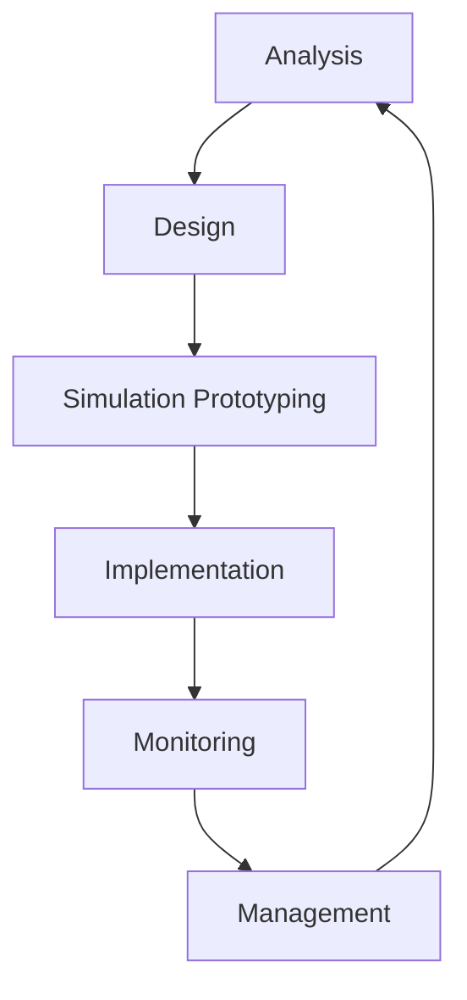

# Otomatisasi Manajemen Virtual Private Network (VPN) Berbasis OpenVPN Pada Mikrotik Menggunakan Ansible

> [!NOTE]
> *Catatan Editor:* Kata kunci (keywords) pada abstrak dokumen asli tampaknya merupakan kesalahan salin-tempel (copy-paste) dari topik penelitian lain yang berkaitan dengan NLP/Klasifikasi Hoaks. Secara kontekstual, artikel ini membahas tentang otomatisasi jaringan MikroTik, Ansible, dan OpenVPN.

---

## Abstrak
Perkembangan teknologi jaringan menuntut efisiensi dan keandalan dalam pengelolaan infrastruktur VPN, terutama dalam lingkungan perusahaan dan organisasi yang kompleks. Penelitian ini bertujuan untuk mengotomatisasi proses konfigurasi OpenVPN pada perangkat MikroTik menggunakan Ansible Playbook guna meningkatkan efisiensi, konsistensi, dan mengurangi risiko human error. Metodologi yang digunakan meliputi analisis kebutuhan, perancangan sistem, implementasi otomatisasi konfigurasi, serta pengujian pada jaringan skala kecil hingga menengah. Hasil penelitian menunjukkan bahwa otomatisasi konfigurasi menggunakan Ansible mampu memangkas waktu provisioning dari sekitar 10 menit menjadi kurang dari 1 menit per perangkat, serta menjamin keseragaman konfigurasi di seluruh perangkat jaringan. Selain itu, penerapan otomatisasi ini dapat memperkuat aspek keamanan dan memudahkan proses pemantauan jaringan VPN secara otomatis melalui sistem monitoring terintegrasi. Berdasarkan hasil tersebut, disarankan agar sistem otomasi ini dikembangkan lebih lanjut dengan fitur monitoring, manajemen akses berbasis peran, dan dokumentasi otomatis untuk mendukung pengelolaan jaringan yang lebih efisien dan aman di masa mendatang.

**Kata kunci:** hoaks politik, TF-IDF, word embedding, klasifikasi, machine learning. *(Sesuai naskah asli)*

---

## Abstract
The development of network technology demands efficiency and reliability in the management of VPN infrastructure, especially in complex corporate and organizational environments. This research aims to automate the OpenVPN configuration process on MikroTik devices using Ansible Playbook to improve efficiency, consistency, and reduce the risk of human error. The methodology used includes requirements analysis, system design, configuration automation implementation, and testing on small to medium scale networks. The results show that configuration automation using Ansible can cut provisioning time from about 10 minutes to less than 1 minute per device, and ensure configuration uniformity across network devices. In addition, the implementation of this automation can strengthen the security aspect and facilitate the process of monitoring the VPN network automatically through an integrated monitoring system. Based on these results, it is recommended that this automation system be further developed with monitoring features, role-based access management, and automated documentation to support more efficient and secure network management in the future.

**Key words:** political hoax, TF-IDF, word embedding, classification, machine learning. *(Sesuai naskah asli)*

---

## 1. Pendahuluan
Di era digital yang berkembang pesat ini, meningkatnya perkembangan teknologi akan berdampak pula pada kebutuhan jaringan yang digunakan. Jaringan komputer adalah gabungan dari dua komputer atau lebih yang telah didesain sedemikian rupa agar dapat saling terhubung satu sama lain untuk dapat melakukan komunikasi, berbagi sumber daya maupun berbagi informasi [1]. Informasi dan data bergerak melalui kabel-kabel atau tanpa kabel sehingga memungkinkan pengguna jaringan komputer dapat saling bertukar dokumen dan data, mencetak pada printer yang sama dan bersama-sama menggunakan hardware atau software yang terhubung.

Sama halnya pada jaringan Wide Area Network (WAN) [2]. WAN adalah tipe jaringan komputer yang mencakup area geografi yang luas, seperti Kota, Negara, ataupun Benua. WAN digunakan untuk menghubungkan beberapa Local Area Network (LAN) dan Metropolitan Area Network (MAN) sehingga perangkat yang berada di lokasi yang jauh dapat saling berkomunikasi, oleh karena itu keamanan jaringan menjadi salah satu aspek yang sangat penting untuk diperhatikan. Perkembangan teknologi informasi dan komunikasi telah memberikan banyak kemudahan bagi kehidupan kita, sehingga menghadirkan risiko serius terkait keamanan jaringan ini [3][2].

Beberapa masalah yang sering ditemui dalam metode tradisional/manual adalah:
1. Pembaruan software/sistem yang harus dilakukan dengan masuk ke setiap server satu per satu.
2. Replikasi konfigurasi jaringan yang identik pada banyak perangkat harus diketik secara manual satu demi satu.
3. Meningkatnya biaya operasional, tidak efisien, rentan terhadap kesalahan manusia (*human error*), dan membutuhkan waktu yang cukup lama seiring dengan bertambahnya perangkat jaringan yang akan dikelola [4].

Penelitian ini menerapkan otomatisasi manajemen Virtual Private Network (VPN) dengan menggunakan protokol OpenVPN pada perangkat MikroTik dengan Ansible Playbook. Ansible merupakan tool bersifat *open source* yang bertugas sebagai alat otomatisasi jaringan pada skala besar dan kecil untuk mempermudah pekerjaan engineer [9][10][6][1][11]. VPN menghubungkan lokasi yang jauh secara geografis dengan aman dan efektif seolah-olah mereka berada di dalam jaringan lokal yang sama [12][13][14].

Pada penelitian ini digunakan metode Network Development Life Cycle (NDLC) untuk merancang, mensimulasikan, mengimplementasikan, dan mengevaluasi konfigurasi OpenVPN (OVPN) menggunakan Ansible Playbook demi meningkatkan efisiensi dan meminimalkan kesalahan manual.

---

## 2. Metode Penelitian
Metode penelitian yang digunakan adalah **Network Development Life Cycle (NDLC)** menurut Goldman dan Rawles (2004). NDLC merupakan siklus proses perancangan atau pengembangan infrastruktur jaringan yang berkesinambungan.



Penelitian ini membatasi implementasi pada tiga tahapan utama dari NDLC agar memiliki urutan kerja yang efisien:

### A. Tahap Analysis
Proses analisis dilakukan untuk mendukung pengembangan sistem otomatisasi manajemen VPN menggunakan Ansible. Tahap ini terbagi menjadi dua bagian:
1. **Pengumpulan Data:** Studi literatur terhadap artikel manajemen konfigurasi OpenVPN pada infrastruktur WAN. Temuan menunjukkan bahwa penelitian terdahulu sebagian besar masih berfokus pada manajemen konfigurasi OpenVPN secara manual.
2. **Analisis Data:** Menyimpulkan pentingnya otomatisasi dan terpadunya aspek keamanan. Pendekatan otomatisasi berbasis Ansible Playbook diharapkan menyederhanakan proses *deployment*, mengurangi risiko kesalahan, serta meningkatkan kecepatan standarisasi penyebaran VPN pada jaringan kompleks.

### B. Tahap Design
Perancangan sistem otomatisasi konfigurasi dibagi menjadi empat bagian:

#### 1) Rancangan Jaringan Ujicoba
Mengadopsi model *client-server*, di mana satu router bertindak sebagai OpenVPN Server (kantor pusat) dan beberapa router bertindak sebagai OpenVPN Client (kantor cabang) yang terhubung melalui jalur terenkripsi internet.

```
                  [ OFFICE PUSAT (Router Pusat) ]
                                 │
                 ┌───────────────┼───────────────┐ (Tunnel OVPN)
                 ▼               ▼               ▼
           [ CABANG LOBAR ] [ CABANG LOTENG ] [ CABANG LOTIM ] ...
```

#### 2) Rancangan Pengalamatan IP
IP address otomatisasi Ansible dikonfigurasikan agar dapat mengelola seluruh router secara remote. IP yang digunakan dikelompokkan sebagai berikut:

##### Tabel 1: Rancangan Pengalamatan IP
| No. | Perangkat | Interface | IP Address | Netmask |
| :--- | :--- | :--- | :--- | :--- |
| 1. | Pnetlab | Eth1 | 192.168.236.194 | 255.255.255.0 |
| 2. | Router Pusat (Mataram) | Ether1 | 10.0.137.233 | 255.255.255.0 |
| | | Ether2 | 192.168.10.1 | 255.255.255.0 |
| | | Ovpn Tunnel | 10.10.10.1 | 255.255.255.255 |
| 3. | Server_pusat | Ether1 | 192.168.10.254 | 255.255.255.0 |
| 4. | Router_officeB (Lobar) | Ether1 | 10.0.137.114 | 255.255.255.0 |
| | | Ether2 | 192.168.30.1 | 255.255.255.0 |
| | | Ovpn Tunnel | 10.10.10.2 | 255.255.255.255 |
| 5. | Server_officeB | Ether1 | 192.168.30.254 | 255.255.255.0 |
| 6. | Router_officeC (Loteng) | Ether1 | 10.0.137.107 | 255.255.255.0 |
| | | Ether2 | 192.168.20.1 | 255.255.255.0 |
| | | Ovpn Tunnel | 10.10.10.3 | 255.255.255.255 |
| 7. | Server_officeC | Ether1 | 192.168.20.254 | 255.255.255.0 |
| 8. | Router_officeD (Lotim) | Ether1 | 10.0.137.62 | 255.255.255.0 |
| | | Ether2 | 192.168.40.1 | 255.255.255.0 |
| | | Ovpn Tunnel | 10.10.10.4 | 255.255.255.255 |
| 9. | Server_officeD | Ether1 | 192.168.40.254 | 255.255.255.0 |
| 10. | Router_officeE (KLU) | Ether1 | 10.0.137.86 | 255.255.255.0 |
| | | Ether2 | 192.168.50.1 | 255.255.255.0 |
| | | Ovpn Tunnel | 10.10.10.5 | 255.255.255.255 |
| 11. | Server_officeE | Ether1 | 192.168.50.254 | 255.255.255.0 |

#### 3) Rancangan Sistem Otomatisasi
Arsitektur otomatisasi meliputi pembuatan playbook Ansible, penataan folder, dan variabel. Proses eksekusi terbagi menjadi dua sisi:
- **Playbook Server:** Pembuatan Sertifikat CA -> Export Sertifikat -> Pembuatan IP Pool OVPN -> PPP Profile OVPN -> Enable OVPN Server -> Add OVPN PPP User -> Add Route to Client.
- **Playbook Client:** Copy Certificate dari Server -> Import Sertifikat -> Tambah Routing ke Pusat -> Add OVPN Client Interface.

#### 4) Kebutuhan Perangkat Keras dan Lunak
- **Perangkat Keras:** Laptop Windows 10 (RAM 8 GB, Core i5), MikroTik Router virtual, Network Adapter.
- **Perangkat Lunak:** VMware Workstation, PnetLab, OpenVPN server package, MikroTik RouterOS.

### C. Tahap Simulasi Prototyping
Simulasi dilakukan untuk menguji fungsionalitas playbook pada 6 perangkat jaringan (1 server utama, 5 router client).

#### 1) Persiapan Environment & Inventory
File inventory didefinisikan untuk mengelompokkan host berdasarkan peran.

```ini
# Ansible Inventory - hosts
[office_a]
10.0.137.233

[office_clients]
10.0.137.114 ansible_ssh_common_args='-o StrictHostKeyChecking=no'
10.0.137.107 ansible_ssh_common_args='-o StrictHostKeyChecking=no'
10.0.137.86  ansible_ssh_common_args='-o StrictHostKeyChecking=no'
10.0.137.62  ansible_ssh_common_args='-o StrictHostKeyChecking=no'

[office_new]
10.0.137.196 ansible_ssh_common_args='-o StrictHostKeyChecking=no'
10.0.137.23  ansible_ssh_common_args='-o StrictHostKeyChecking=no'

[all:vars]
ansible_user=admin
ansible_password="123"
ansible_network_os=routeros
ansible_connection=network_cli
host_key_checking=false
```

#### 2) Penyusunan Playbook

##### Playbook Server (`playbook_server.yml`)
```yaml
---
- name: Setup OpenVPN Server (Office A)
  hosts: office_a
  gather_facts: no
  tasks:
    - name: Create certificate templates
      community.routeros.command:
        commands:
          - /certificate add name=myCA common-name=myCA key-usage=key-cert-sign,crl-sign
          - /certificate add name=server common-name=server key-usage=digital-signature,key-encipherment,tls-server
          - /certificate add name=officeB common-name=officeB key-usage=digital-signature,key-encipherment,tls-client
          - /certificate add name=officeC common-name=officeC key-usage=digital-signature,key-encipherment,tls-client
          - /certificate add name=officeD common-name=officeD key-usage=digital-signature,key-encipherment,tls-client
          - /certificate add name=officeE common-name=officeE key-usage=digital-signature,key-encipherment,tls-client

    - name: Sign certificates
      community.routeros.command:
        commands:
          - /certificate sign myCA name=myCA
          - /certificate sign server name=server ca=myCA
          - /certificate sign officeB name=officeB ca=myCA
          - /certificate sign officeC name=officeC ca=myCA
          - /certificate sign officeD name=officeD ca=myCA
          - /certificate sign officeE name=officeE ca=myCA

    - name: Set certificates as trusted
      community.routeros.command:
        commands:
          - /certificate set myCA trusted=yes
          - /certificate set officeB trusted=yes
          - /certificate set officeC trusted=yes
          - /certificate set officeD trusted=yes
          - /certificate set officeE trusted=yes

    - name: Create ip pool for OVPN
      community.routeros.command:
        commands:
          - /ip pool add name=ovnpool ranges=10.10.10.2-10.10.10.254

    - name: Create PPP profile for OVPN
      community.routeros.command:
        commands:
          - /ppp profile add local-address=10.10.10.1 name=ovpntes remote-address=ovnpool

    - name: Enable OpenVPN server
      community.routeros.command:
        commands:
          - /interface ovpn-server server set certificate=server cipher=blowfish128,aes256 enabled=yes default-profile=ovpntes require-client-certificate=yes

    - name: Add OVPN PPP user
      community.routeros.command:
        commands:
          - /ppp secret add name=officeB password=1234 service=ovpn profile=ovpntes remote-address=10.10.10.2
          - /ppp secret add name=officeC password=1234 service=ovpn profile=ovpntes remote-address=10.10.10.3
          - /ppp secret add name=officeD password=1234 service=ovpn profile=ovpntes remote-address=10.10.10.4
          - /ppp secret add name=officeE password=1234 service=ovpn profile=ovpntes remote-address=10.10.10.5

    - name: Export CA and client certificates
      community.routeros.command:
        commands:
          - /certificate export-certificate myCA export-passphrase=""
          - /certificate export-certificate officeB export-passphrase="12345678"
          - /certificate export-certificate officeC export-passphrase="12345678"
          - /certificate export-certificate officeD export-passphrase="12345678"
          - /certificate export-certificate officeE export-passphrase="12345678"

    - name: Add route to office LANs
      community.routeros.command:
        commands:
          - /ip route add dst-address=192.168.20.1/24 gateway=10.10.10.2
          - /ip route add dst-address=192.168.30.1/24 gateway=10.10.10.3
          - /ip route add dst-address=192.168.40.1/24 gateway=10.10.10.4
          - /ip route add dst-address=192.168.50.1/24 gateway=10.10.10.5
```

##### Playbook Client (`playbook_client.yml`)
```yaml
---
- name: Setup OpenVPN Client (Office B)
  hosts: 10.0.137.114
  gather_facts: no
  tasks:
    - name: copy certificate
      community.routeros.command:
        commands:
          - /tool fetch address=10.0.137.233 src-path=cert_export_officeB.crt user=admin mode=ftp password=1234
          - /tool fetch address=10.0.137.233 src-path=cert_export_officeB.key user=admin mode=ftp password=1234
          - /tool fetch address=10.0.137.233 src-path=cert_export_myCA.crt user=admin mode=ftp password=1234

    - name: Import sertifikat client and CA
      community.routeros.command:
        commands:
          - /certificate import name=officeB file-name=cert_export_officeB.crt passphrase="12345678"
          - /certificate import name=officeB file-name=cert_export_officeB.key passphrase="12345678"
          - /certificate import name=myCA file-name=cert_export_myCA.crt passphrase=""

    - name: Tambah routing ke office A LAN
      community.routeros.command:
        commands:
          - /ip route add dst-address=192.168.10.0/24 gateway=10.10.10.1 pref-src="" routing-table=main scope=30 target-scope=10

    - name: NAT untuk interface WAN
      community.routeros.command:
        commands:
          - /ip firewall nat add chain=srcnat out-interface=ether1 action=masquerade

    - name: add OVPN Client Interface
      community.routeros.command:
        commands:
          - /interface ovpn-client add certificate=officeB cipher=aes256 connect-to=10.0.137.233 name=officeB user=officeB password=1234 verify-server-certificate=yes
```

---

## 3. Analisa Hasil Ujicoba
Pengujian dilakukan dengan mengaktifkan layanan OpenVPN Client dan menguji konektivitas menggunakan utilitas `ping` ke IP internal server VPN (10.10.10.1). Pengujian terbukti berhasil dengan terbentuknya antarmuka virtual tunnel dan transfer data yang stabil.

### a) Perbandingan Waktu Konfigurasi
Eksperimen diulang sebanyak 3 kali untuk membandingkan durasi instalasi/pembuatan layanan secara manual dan otomatis menggunakan Ansible.

##### Tabel 2: Perbandingan Waktu Pembuatan OpenVPN
| Percobaan | Server Manual | Server Otomatis | Client B Manual | Client B Otomatis | Client C Manual | Client C Otomatis | Client D Manual | Client D Otomatis | Client E Manual | Client E Otomatis |
| :---: | :--- | :--- | :--- | :--- | :--- | :--- | :--- | :--- | :--- | :--- |
| **1** | 20 m 25 s | 6 m 10 s | 10 m 30 s | 1 m 50 s | 10 m 20 s | 1 m 45 s | 10 m 12 s | 1 m 43 s | 9 m 58 s | 1 m 45 s |
| **2** | 15 m 58 s | 5 m 50 s | 10 m 40 s | 2 m 00 s | 10 m 21 s | 1 m 47 s | 10 m 18 s | 1 m 47 s | 10 m 07 s | 1 m 45 s |
| **3** | 18 m 15 s | 5 m 30 s | 10 m 25 s | 2 m 00 s | 10 m 15 s | 1 m 50 s | 10 m 11 s | 1 m 45 s | 9 m 50 s | 1 m 40 s |
| **Tercepat**| 15 m 58 s | 5 m 30 s | 10 m 25 s | 1 m 50 s | 10 m 15 s | 1 m 45 s | 10 m 11 s | 1 m 43 s | 9 m 50 s | 1 m 40 s |
| **Terlama** | 20 m 25 s | 6 m 10 s | 10 m 40 s | 2 m 00 s | 10 m 21 s | 1 m 50 s | 10 m 18 s | 1 m 47 s | 10 m 07 s | 1 m 45 s |
| **Rata-rata**| 15–20 m | 5–6 m | 10 m | 1-2 m | 10 m | 1-2 m | 10 m | 1-2 m | 9-10 m | 1-2 m |

##### Tabel 3: Perbandingan Waktu Teardown / Penghapusan OpenVPN
| Percobaan | Client B Manual | Client B Otomatis | Client C Manual | Client C Otomatis | Client D Manual | Client D Otomatis | Client E Manual | Client E Otomatis |
| :---: | :--- | :--- | :--- | :--- | :--- | :--- | :--- | :--- |
| **1** | 2 m 30 s | 1 m 05 s | 2 m 20 s | 1 m 04 s | 2 m 22 s | 1 m 00 s | 2 m 18 s | 1 m 05 s |
| **2** | 2 m 23 s | 0 m 58 s | 2 m 21 s | 0 m 57 s | 2 m 23 s | 0 m 58 s | 2 m 20 s | 0 m 56 s |
| **3** | 2 m 20 s | 1 m 00 s | 2 m 15 s | 0 m 57 s | 2 m 21 s | 1 m 00 s | 2 m 25 s | 1 m 00 s |
| **Tercepat**| 2 m 20 s | 0 m 58 s | 2 m 15 s | 0 m 57 s | 2 m 21 s | 0 m 58 s | 2 m 18 s | 0 m 56 s |
| **Terlama** | 2 m 30 s | 1 m 05 s | 2 m 21 s | 1 m 04 s | 2 m 23 s | 1 m 47 s | 2 m 25 s | 1 m 05 s |
| **Rata-rata**| 2 m | 50-60 s | 2 m | 50-60 s | 2 m | 50-60 s | 2 m | 50-60 s |

### b) Hasil Analisis Penambahan Client Baru
Penambahan client baru cukup dilakukan dengan menambahkan IP target ke dalam file inventory Ansible dan menjalankan playbook ulang. Semua tahapan dari pembuatan sertifikat, distribusi file, konfigurasi router, hingga routing dilakukan secara otomatis tanpa intervensi manual pada perangkat.

---

## 4. Kesimpulan
Sistem otomatisasi konfigurasi VPN berbasis OpenVPN menggunakan Ansible terbukti meningkatkan efisiensi waktu provisioning perangkat MikroTik secara signifikan. Konfigurasi server yang awalnya memakan waktu rata-rata 18 menit dapat dipangkas menjadi 5-6 menit secara otomatis. Sedangkan konfigurasi client di cabang terpangkas dari 10 menit menjadi kurang dari 2 menit. 

Sistem ini menjamin konsistensi konfigurasi secara menyeluruh, mengeliminasi kesalahan penulisan (*human error*), serta memfasilitasi skalabilitas manajemen jaringan secara dinamis dan aman.

---

## Referensi
1. N. M. A. Yalestia Chandrawaty and I. P. Hariyadi, “Implementasi Ansible Playbook Untuk Mengotomatisasi Manajemen Konfigurasi VLAN Berbasis VTP Dan Layanan DHCP,” *Jurnal Bumigora Information Technology (BITe)*, vol. 3, no. 2, pp. 107–122, 2021, doi: 10.30812/bite.v3i2.1577.
2. D. Asriani Siregar et al., “Pengenalan Jaringan Komputer Dasar Di Smk Negeri 1 Batang Onang,” *Jurnal ADAM: Jurnal Pengabdian Masyarakat*, vol. 2, no. 2, pp. 293–303, 2023, doi: 10.37081/adam.v2i2.1443.
3. M. D. S. Antariksa and A. Aranta, “Analisis Jaringan Komputer Local Area Network (LAN) Di Rumah Sakit UNRAM,” *Jurnal Begawe Teknologi Informasi (JBegaTI)*, vol. 3, no. 2, pp. 201–212, 2022, doi: 10.29303/jbegati.v3i2.748.
4. M. Rifki Afandi, P. Hatta, A. Efendi, K. Kunci-Otomatisasi Jaringan, L. Komputer, and P. Jaringan, “Otomatisasi Perangkat Jaringan Komputer Menggunakan Ansible Pada Laboratorium Komputer,” *SMARTICS Journal*, vol. 6, no. 2, pp. 48–53, 2020, [Online]. Available: https://doi.org/10.21067/smartics.v6i2.4599
5. A. H. Prayoga, K. Insani, and D. A. Farizal, “Implementasi Otomatisasi Backup Pada Router Mikrotik Server Jaringan Internet Universitas Majalengka,” *INFOTECH journal*, vol. 10, no. 2, pp. 228–233, 2024, doi: 10.31949/infotech.v10i2.10851.
6. M. A. A. Pratama and I. P. Hariyadi, “Otomasi Manajemen dan Pengawasan Linux Container (LCX) Pada Proxmox VE Menggunakan Ansible,” *Jurnal Bumigora Information Technology (BITe)*, vol. 3, no. 1, pp. 82–95, 2021, doi: 10.30812/bite.v3i1.807.
7. F. D. J. Prasetyo, H. Sutarjo, D. Triantoro, and D. V. S. Y. Sakti, “Otomatisasi Backup Konfigurasi Perangkat Jaringan Komputer Cisco,” *Journal MIND Journal*, vol. 9, no. 1, pp. 99–112, 2024. [Online]. Available: https://ejurnal.itenas.ac.id/index.php/mindjournal/article/view/11204/3665
8. M. Fahmi, M. Maisyaroh, I. Komarudin, S. Faizah, and I. Fadhilah, “Otomatisasi Jaringan Menggunakan Script Python Untuk Penyediaan Konfigurasi Internet Dan Manajemen Mikrotik,” *Bina Insani Ict Journal*, vol. 8, no. 1, p. 53, 2021, doi: 10.51211/biict.v8i1.1517.
9. E. N. Fadhila, E. R. Gumelar, H. R. Pratama, and G. M. Suranegara, “Otomasi Konfigurasi Routing pada Router menggunakan Ansible,” *Telecommunications, Networks, Electronics, and Computer Technologies (TELNECT)*, vol. 1, no. 2, pp. 93–98, 2021, [Online]. Available: https://ejurnal.upi.edu/index.php/TELNECT/article/view/40806
10. N. Evianti, M. A. Wihandar, and A. Kurniawan, “Automation Provisioning Dev-Ops Website Server Menggunakan Ansible Dan Vagrant,” *Jurnal Nasional Informatika*, vol. 2, no. 2, pp. 72–91, 2021.
11. I. Sting et al., “B,” vol. 9, no. 5, pp. 2662–2664, 2023.
12. T. Rahman, G. M. V. T. Mariatmojo, H. Nurdin, and H. Kuswanto, “Implementasi VPN Pada VPS Server Menggunakan OpenVPN dan Raspberry Pi,” *Teknika*, vol. 11, no. 2, pp. 138–147, 2022, doi: 10.34148/teknika.v11i2.482.
13. R. Ramesh, L. Evdokimov, D. Xue, and R. Ensafi, “VPNalyzer: Systematic Investigation of the VPN Ecosystem,” *29th Annual Network and Distributed System Security Symposium, NDSS 2022*, no. April, 2022, doi: 10.14722/ndss.2022.24285.
14. K. Ghanem, S. Ugwuanyi, J. Hansawangkit, R. McPherson, R. Khan, and J. Irvine, “Security vs Bandwidth: Performance Analysis between IPsec and OpenVPN in Smart Grid,” *2022 International Symposium on Networks, Computers and Communications (ISNCC)*, 2022, doi: 10.1109/ISNCC55209.2022.9851717.
15. Y. Sudarman, “Analisa Penerapan Intrusion Prevention System (Ips) Untuk Mengamankan Container Docker,” 2020.
