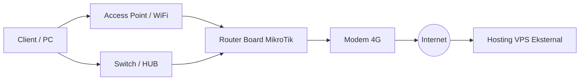

# Pengembangan Virtual Server dengan Proxmox VE 6.2 sebagai Cloud Computing berbasis Free/Open Source Software

## Abstrak
Pada saat ini pengelolaan data dan layanan mahasiswa di STMIK AUB Surakarta belum dilaksanakan secara tersentral karena masih tersimpan di masing-masing unit pelaksana dan belum bisa saling terintegrasi satu sama lain serta server konten digital seperti: e-journal masih menggunakan web hosting dari luar, ini dikarenakan dalam segi tenaga ahli dan ketersediaan resource hardware perangkat server yang belum mampu dalam menunjang layanan kebutuhan mahasiswa yang telah tersedia sehingga bermuara pada belum optimalnya pemanfaatan infrastruktur virtual server di kalangan mahasiswa dan civitas akademika STMIK AUB Surakarta. Tujuan penelitian ini untuk mengembangkan infrastruktur virtual server agar layanan kebutuhan mahasiswa di STMIK AUB Surakarta seperti server konten digital e-learning, pengabdian alumni, pengelolaan data dan layanan mahasiswa menjadi tersentral, dapat terintegrasi dengan baik ke bagian-bagian unit pelaksana dan fleksibel mendukung berbagai layanan kampus yang tersedia. Maka dilakukanlah penelitian yaitu membangun infrastruktur server cloud computing dengan Proxmox VE 6.2 dengan menggunakan metode System Infrastructure Development Life Cycle for Enterprise Computing Systems (SIDLC). Hasil Penelitian dari topik ini adalah diimplementasikannya virtual server menggunakan Proxmox VE 6.2 yang berisikan beberapa sistem operasi yang berfungsi sebagai web server, file server, database server mendukung layanan e-learning dan pengabdian alumni sekaligus dapat fleksibel untuk mencakup seluruh civitas akademika. Kesimpulan dalam penelitian ini yaitu didapatkan infrastruktur virtual server yang bekerja secara tersentral dan saling terintegrasi dengan bagian unit pelaksana serta mendukung baik dalam perkuliahan e-learning, pengolahan data dan layanan alumni mahasiswa maupun perangkat pendukung diluarnya.

**Kata kunci:** Virtual Server, Cloud Computing, Proxmox VE 6.2

---

## Abstract
At this time, data management and student services at STMIK AUB Surakarta have not been implemented centrally because they are still stored in each implementing unit and cannot be integrated with each other and digital content servers such as: e-journals still use external web hosting. because in terms of experts and the availability of server hardware resources that have not been able to support the service needs of students that have been available so that it leads to not optimal utilization of virtual server infrastructure among students and the academic community of STMIK AUB Surakarta. The purpose of this research is to develop a virtual server infrastructure so that the services needed by students at STMIK AUB Surakarta such as e-learning digital content servers, alumni service, data management and student services are centralized, can be well integrated into the parts of the implementing unit and flexible support various services. available campuses. Then a research was carried out, namely building a cloud computing server infrastructure with Proxmox VE 6.2 using the System Infrastructure Development Life Cycle for Enterprise Computing Systems (SIDLC) method. The research result of this topic is the implementation of a virtual server using Proxmox VE 6.2 which contains several operating systems that function as web servers, file servers, database servers that support e-learning services and alumni service as well as being flexible to cover the entire academic community. The conclusion in this study is that we get a virtual server infrastructure that works centrally and is mutually integrated with the implementing unit and supports both e-learning lectures, data processing and student alumni services as well as external supporting devices.

**Keywords:** Virtual Server, Cloud Computing, Proxmox VE 6.2

---

## 1. Pendahuluan
* **Konteks:** Virtualisasi server adalah langkah penting dalam perencanaan strategis pengembangan jaringan di STMIK AUB Surakarta. Tujuannya adalah meningkatkan efisiensi, memfasilitasi *capacity building*, dan mendukung Tri Dharma Perguruan Tinggi (pendidikan, penelitian, pengabdian masyarakat).
* **Masalah:**
  * Pengelolaan data dan layanan mahasiswa belum tersentral (tersimpan di unit pelaksana terpisah).
  * Web hosting konten digital seperti e-journal masih menyewa dari luar.
  * Keterbatasan tenaga ahli dan sumber daya perangkat keras server.
  * Infrastruktur virtual server yang ada belum terintegrasi dengan baik ke unit pelaksana.
* **Solusi:** Membangun infrastruktur server *cloud computing* berbasis *hypervisor* menggunakan **Proxmox VE 6.2** dengan metode **System Infrastructure Development Life Cycle for Enterprise Computing Systems (SIDLC)**.

---

## 2. Metode Penelitian

### 2.1 Teknik Pengumpulan Data
* **Teknik Observasi:** Peninjauan langsung pengelolaan data mahasiswa dan alumni di unit pelaksana kampus, serta penggunaan server konten digital yang sudah ada.
* **Teknik Wawancara:** Diskusi dengan Agung Nugroho (Ketua Laboratorium STMIK AUB) mengenai jumlah pengguna, model konektivitas, dan pemetaan jaringan server.
* **Studi Literatur:** Mempelajari referensi jurnal/buku terkait virtual server berbasis FOSS (Free Open Source Software) pada Proxmox VE.

### 2.2 Tahapan Penelitian (SIDLC)
1. **Analysis (Analisis):** Menganalisis kebutuhan infrastruktur virtual server untuk mendukung integrasi pelayanan civitas akademika.
2. **Design (Desain):** Merancang infrastruktur dengan menyesuaikan faktor lingkungan, lokasi pengguna, spesifikasi perangkat keras, aplikasi, dan aktivitas pengguna.
3. **Testing (Pengujian):** Uji coba pembuatan *prototype* menggunakan VirtualBox. Pengujian konektivitas menggunakan perintah `ping` dan `nslookup`, serta uji coba VM.
4. **Implementation (Implementasi):** Konfigurasi server fisik dengan Proxmox VE 6.2, pembuatan controller, pembagian IP statis via TCP/IP agar akses layanan stabil.
5. **Maintenance (Pemeliharaan):** Dokumentasi troubleshooting untuk menangani potensi masalah seperti *IP conflict*, kesalahan firewall, kegagalan fisik (kabel, port), *overloaded server*, atau gangguan DNS.

---

## 3. Hasil dan Pembahasan

### 3.1 Unit Penelitian
Penelitian dilakukan di STMIK AUB Surakarta, Jl. Walanda Maramis No. 29, Nusukan, Kec. Banjarsari, Kota Surakarta, Jawa Tengah.

### 3.2 Analisis Perangkat Keras
Infrastruktur dibangun menggunakan spesifikasi perangkat keras minimal berikut:

#### Tabel 1: Kebutuhan Perangkat Keras
| No. | Nama Perangkat (Device Name) | Spesifikasi (Specification) | Jumlah |
| :--- | :--- | :--- | :---: |
| 1 | Processor | CPU Dual Core Intel Processor | 1 Pcs |
| 2 | Memory | 6 GB DDR3 RAM | 2 Pcs |
| 3 | Harddisk | 160 GB SATA | 2 Pcs |
| 4 | Network Card | 100 Mbps Fast Ethernet | 1 Pcs |
| 5 | UTP Cable | Min. Cat5E | 1 M |
| 6 | Modem Router | Huawei 4G Router B310 (LTE CAT4 up to 150Mbps) | 1 Unit |
| 7 | Kartu SIM | Perdana Internet | 1 Pcs |

### 3.3 Analisa Perangkat Lunak
Kebutuhan sistem operasi dan perangkat lunak pendukung:

#### Tabel 2: Kebutuhan Perangkat Lunak
| No. | Nama Perangkat | Spesifikasi | Jumlah |
| :--- | :--- | :--- | :---: |
| 1 | Proxmox VE 6.2 | IaaS (Server Cloud) & Engine Virtualization | 1 Pcs |
| 2 | TurnKey Linux | Virtual Appliance, SaaS, OpenVZ Container, KVM | 2 Pcs |
| 3 | Browser Java Enabled | Remote VM, OpenVZ, dan KVM | 1 Pcs |

### 3.4 Cara Kerja Sistem
Proxmox VE bertindak sebagai *hypervisor* berbasis Debian Linux. Seluruh VM (*Virtual Machine*) dan *container* dikontrol melalui konsol web terintegrasi. Keamanan antar-OS diatur menggunakan firewall berlapis pada tingkat *datacenter*, *node*, hingga LXC container/KVM VM secara ter-bridge.

---

### 3.5 Desain Sistem yang Sedang Berjalan
Sebelumnya, kampus menggunakan jasa Hosting VPS eksternal untuk meng-host website.



### 3.6 Desain Sistem yang Dibangun
Pengembangan melibatkan penambahan 1 server fisik lokal untuk menjalankan 3 mesin server virtual (2 Container dan 1 VM KVM).

```mermaid
graph TD
  subgraph Server Fisik Lokal
    subgraph Proxmox VE 6.2 (Debian Linux)
      CT1[Debian CT: Moodle e-Learning]
      CT2[Debian CT: Sahana Eden Alumni]
      VM1[Debian VM: SLiMS e-Library]
    end
  end

  Client1[Client / PC] --> AP[Access Point / WiFi]
  Client2[Client / PC] --> Hub[Switch / HUB]
  AP --> Mikrotik[Router Board MikroTik]
  Hub --> Mikrotik
  Mikrotik --> SwitchLokal[Switch / HUB Lokal]
  SwitchLokal --> ServerFisik[Server Fisik Lokal]
  Mikrotik --> Modem[Modem 4G]
  Modem --> Internet((Internet))
```

---

### 3.7 Pengujian Perangkat
1. **Akses Web Console (Port 8006):** Proxmox dikendalikan lewat GUI web console terintegrasi melalui port 8006 (misal: `https://192.168.8.100:8006`).
2. **Akses SSH (Port 22):** Remote management CLI menggunakan aplikasi Putty untuk keperluan konfigurasi tingkat lanjut.
3. **Akses VM Console (Qemu):** Digunakan untuk mengelola langsung virtual machine Debian 10 (Gambar 6).
4. **Akses Linux Container (LXC):** Memvalidasi jalannya aplikasi web Moodle (Gambar 7) dan Sahana Eden (Gambar 8).

#### Tabel 3: Informasi Sistem Operasi Virtual yang Terpasang
| No | Nama Sistem Operasi | Jenis Virtualisasi | Spesifikasi / Layanan |
| :--- | :--- | :--- | :--- |
| 1 | Debian Linux | CT (LXC Container) | Web Server Moodle, RAM 256 MB, 1 vCPU |
| 2 | Debian Linux | CT (LXC Container) | Web Server Sahana Eden, RAM 256 MB, 1 vCPU |
| 3 | Debian Linux | KVM (Virtual Machine) | Web Server SLiMS (Library), RAM 512 MB, 1 vCPU |

---

### 3.8 Pengujian Performa Perangkat Server
Pengamatan performansi server dilakukan dengan memantau utilitas CPU dan RAM dalam berbagai kombinasi status aktif (0 = Mati, 1 = Hidup) pada 3 virtual server: VM 103 (KVM SLiMS), CT 101 (CT Sahana), dan CT 100 (CT Moodle).

#### Tabel 4: Hasil Pengamatan Performansi Hypervisor
| VM 103 (KVM) | CT 101 (LXC) | CT 100 (LXC) | % CPU (Processor) | % Memory (RAM) |
| :---: | :---: | :---: | :---: | :---: |
| 0 | 0 | 0 | 1.62% | 20.37% |
| 0 | 0 | 1 | 2.10% | 22.47% |
| 0 | 1 | 0 | 1.31% | 20.68% |
| 0 | 1 | 1 | 1.46% | 22.65% |
| 1 | 0 | 0 | 9.04% | 47.78% |
| 1 | 0 | 1 | 4.46% | 50.05% |
| 1 | 1 | 0 | 15.77% | 48.10% |
| 1 | 1 | 1 | 13.95% | 50.34% |

*Analisis:* KVM Virtual Machine (VM 103) memakan resource CPU dan Memory yang jauh lebih besar (~9% CPU dan ~27% RAM saat menyala sendiri) dibandingkan dengan Linux Container (CT 101/100) yang hanya membutuhkan resource sangat minim (~0.3% - 0.5% CPU dan ~2% RAM per container).

---

### 3.9 Pembahasan Skenario Pengguna
Semua pengguna harus menggunakan otentikasi melalui realm `Proxmox VE Authentification`:
* **Skenario Server Pendidikan (Moodle e-Learning):** Hak akses ditujukan untuk Dosen dan Mahasiswa menggunakan akun terdaftar untuk perkuliahan (Gambar 9).
* **Skenario Server Pengabdian (Sahana Eden):** Digunakan oleh civitas akademika STMIK AUB Surakarta untuk keperluan manajemen kebencanaan / pengabdian masyarakat (Gambar 10).
* **Skenario Server Penelitian (SLiMS e-Library):** Digunakan untuk layanan perpustakaan digital civitas akademika (Gambar 11).

---

## 4. Kesimpulan
1. Penelitian berhasil mengimplementasikan infrastruktur *virtual server* menggunakan Proxmox VE 6.2 secara terpusat untuk mengintegrasikan berbagai layanan kampus (Moodle e-learning, Sahana Eden pengabdian, dan SLiMS e-library).
2. Sistem dapat melayani kebutuhan komputasi kampus secara fleksibel dan efisien dengan mengombinasikan KVM (untuk isolasi sistem penuh) dan LXC/Container (untuk efisiensi resource RAM/CPU).
3. Pengujian performansi membuktikan penggunaan Container (LXC) jauh lebih hemat resource dibandingkan KVM VM tradisional.

---

## 5. Saran
Untuk pengembangan selanjutnya, disarankan membangun topologi yang lebih kompleks dengan jumlah server fisik yang lebih banyak (clustering) dan menerapkan Single Sign-On (SSO) agar pengguna cukup melakukan login satu kali untuk mengakses seluruh layanan server.

---

## Daftar Pustaka
1. Adiwibowo, Wishnumurti. 2013. Kernel-Based Virtual Machine Untuk Virtualisasi Database Sebagai Solusi Kebutuhan Perangkat Keras Studi Kasus Implementasi Sistem Informasi Klinik Kecantikan. *Jurnal Transformatika*. Volume 10, No. 2.
2. Afriandi, Arief. 2012. Perancangan, Implementasi, dan Analisisi Kinerja Virtualisasi Server Menggunakan Proxmox, VMWare ESX, dan OpenStack. *Jurnal Informasi*. Volume 5, No. 2.
3. Agung, R. 2013. *Pengertian dan Jenis Routing*. mikrotikindo.blogspot.com.
4. Ahmed, Wasim. 2014. *Mastering Proxmox*. Edisi Kedua. United Kingdom: Packt Publishing.
5. Arianto. 2017. *Perbandingan Full Virtualization dan Paravirtualization untuk Mendukung Efisiensi Energi*. Skripsi. Universitas Indonesia.
6. Dillon, Tharam. 2010. *Cloud Computing: Issues and Challenges*. Edisi Pertama. Australia: IEEE.
7. Fadjirin, Akbar, Jahnsen Gultom. 2013. Cloud Computing Server Menggunakan Proxmox Pada CV. Cipta Solusi Sejahtera. *Jurnal Transformatika*. Volume 11, No. 4.
8. Firmansyah, Yudha Christianto. 2019. Analisis Teknologi Virtual Mesin Proxmox dalam Rangka Persiapan Infrastruktur Server. *Jurnal INFORMA Politeknik Indonusa Surakarta*. Vol. 5, Nomor 3.
9. Harijanto, Budi. 2015. Desain dan Analisis Kinerja Virtualisasi Server menggunakan Proxmox Virtual Environment. *Jurnal Simantec*. Vol. 5, No. 1.
10. Jiang, Min. Jong, Chu J. Poppell, Paul. Budhathoky, Keshab. Hull, Ryan. 2009. *System Infrastructure Development Life Cycle for Enterprise Computing Systems*. Edisi Pertama. China: IEEE.
11. Julianti, M. Ramaddan. 2019. Perancangan Server Cloud Computing Model Infrastructure As A Service Berbasis Proxmox pada PT Fortuna Mediatama. *Academic Journal of Computer Science Research*. Vol. 1, No. 1.
12. Kovari, A. Dukan. 2012. *KVM & OpenVZ virtualization based IaaS Open Source Cloud Virtualization Platforms: OpenNode, Proxmox VE*. Edisi Pertama. Serbia: IEEE.
13. Nuhajat. 2014. Membangun Cloud Computing berbasis Free/Open Source Software (F/OSS) pada STMIK Widya Cipta Dharma. *Academic Journal of Computer Science Research*. Vol. 1, No. 1.
14. O'brien. 2013. *Virtualisasi Server dengan Proxmox untuk Pengoptimalisasian Penggunaan Resource Server pada Upt Teknologi dan Komunikasi Pendidikan*.
15. Perdana, Noki Putra. 2015. Pembangunan Jaringan Local Area Network (Lan) PT. Niaga Swadaya Yogyakarta. *Jurnal IJNS*.
16. Prasandy, Teguh. Wishnumurti. 2015. Virtualisasi Server Sederhana Menggunakan Proxmox. *Jurnal Transformatika*. Volume 12, No. 2.
17. Prawedha, Dhantel Rhesa. 2018. Rancang Bangun Hypervisor Menggunakan Proxmox VE 5.0 Sebagai Virtual Server Infrastructure di STMIK AUB Surakarta. *Jurnal Publikasi Komputer*. Vol. 2, No. 1.
18. Rafiudin, R. 2003. *Panduan Membangun Jaringan Komputer Untuk Pemula*. cet.2. Jakarta: PT Elex Media Komputindo.
19. Suhatman, Rachmat. 2016. Analisa Performansi Server Cloud Berbasis Proxmox VE untuk Multi Server dan Multi Platform pada Praktikum Administrasi Jaringan Komputer. *Jurnal Komputer Terapan*. Vol 2. No.1.
20. Suryono, Tito. 2012. Pembuatan Prototype Virtual Server Menggunakan Proxmox VE Untuk Optimalisasi Resource Hardware di NOC FKIP UNS. *Indonesian Journal on Networking and Security*. Volume 1, Nomor 1.
21. Syamsudin, Ricky Chandra. 2014. Perancangan Servercloud Computing Menggunakan Proxmox. *Jurnal SATIN - Sains dan Teknologi Informasi*. Vol. 3, No. 2.
22. Towidjojo, R. 2013. *Konsep dan Implementasi Routing dengan Router Mikrotik*. Edisi Pertama. Jakarta: Jasakom.
23. Yuhefizar. 2003. *Tutorial Komputer dan Jaringan*. http://ilmukomputer.com.
